# THIẾT KẾ DDD & MICROSERVICES — HỆ THỐNG CAB (23710361_PhanVanAn_cabSystem)

---

## 1. Chiến lược phân rã (Strategic Design)

Nguyên tắc phân tách Bounded Context:
- Mỗi BC sở hữu **1 phần dữ liệu riêng** (không share database), giao tiếp qua **domain event** (bất đồng bộ) hoặc **API** (đồng bộ) khi cần dữ liệu tức thời.
- Phân loại subdomain:
  - **Core Domain** (lợi thế cạnh tranh): Booking, Dispatch/Matching, Trip Management — đây là "trái tim" của bài toán đặt xe (BG-01, BG-02, BG-05).
  - **Supporting Domain**: Customer, Driver & Vehicle, Location, Pricing, Payment, Rating, Trip History, Operations, Reporting.
  - **Generic Domain**: Identity & Access, Notification, Audit Log — có thể mua giải pháp có sẵn (Keycloak, Twilio/FCM, ELK) nhưng vẫn tách BC để cô lập lỗi (NFR-06, NFR-07, BG-10).

## 2. Bảng Bounded Context ↔ FR

| # | Bounded Context | FR liên quan | Loại subdomain |
|---|---|---|---|
| BC1 | **Identity & Access** | FR-13 (13.1 Xác thực, 13.2 Phân quyền, 13.3 Bảo vệ dữ liệu) | Generic |
| BC2 | **Customer Management** | FR-01 (01.1 Đăng ký, 01.3 Cập nhật) | Supporting |
| BC3 | **Driver & Vehicle Management** | FR-07 (07.1→07.4) | Supporting |
| BC4 | **Booking (Ride Request)** | FR-02 (02.1→02.5) | **Core** |
| BC5 | **Dispatch / Matching** | FR-03 (03.1→03.5), FR-04 (04.1→04.5) | **Core** |
| BC6 | **Location Tracking** | FR-06 (06.1→06.4) | Supporting |
| BC7 | **Trip Management** | FR-05 (05.1→05.6) | **Core** |
| BC8 | **Pricing / Fare** | FR-08.1 | Supporting |
| BC9 | **Payment** | FR-08.2, FR-08.3, FR-08.4 | Supporting |
| BC10 | **Notification** | FR-09 (09.1→09.4) | Generic |
| BC11 | **Rating & Feedback** | FR-10.3 | Supporting |
| BC12 | **Trip History (read-model)** | FR-10.1, FR-10.2 | Supporting |
| BC13 | **Operations / Back-office** | FR-11 (11.1→11.5) | Supporting |
| BC14 | **Reporting & Analytics** | FR-12 (12.1→12.5) | Supporting |
| BC15 | **Audit Log** | FR-13.4 | Generic |

## 3. Context Map (quan hệ tích hợp)

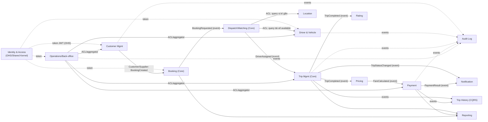
```mermaid
flowchart LR
    IAM["Identity & Access\n(OHS/Shared Kernel)"]
    CUS["Customer Mgmt"]
    DRV["Driver & Vehicle"]
    BOOK["Booking (Core)"]
    DISP["Dispatch/Matching (Core)"]
    LOC["Location"]
    TRIP["Trip Mgmt (Core)"]
    PRICE["Pricing"]
    PAY["Payment"]
    NOTI["Notification"]
    RATE["Rating"]
    HIST["Trip History (CQRS)"]
    OPS["Operations/Back-office"]
    REPORT["Reporting"]
    AUDIT["Audit Log"]

    IAM -. "token JWT (OHS)" .-> CUS
    IAM -. token .-> DRV
    IAM -. token .-> BOOK
    IAM -. token .-> OPS

    CUS -->|"Customer/Supplier: BookingCreated"| BOOK
    BOOK -->|"BookingRequested (event)"| DISP
    DISP -->|"ACL: query tài xế available"| DRV
    DISP -->|"ACL: query vị trí gần"| LOC
    DISP -->|"DriverAssigned (event)"| TRIP
    TRIP -->|"TripStatusChanged (event)"| NOTI
    TRIP -->|"TripCompleted (event)"| PRICE
    PRICE -->|"FareCalculated (event)"| PAY
    PAY -->|"PaymentResult (event)"| NOTI
    TRIP -->|"TripCompleted (event)"| RATE
    TRIP -->|"events"| HIST
    PAY -->|"events"| HIST
    TRIP --> REPORT
    PAY --> REPORT
    BOOK --> REPORT
    OPS -->|"ACL/aggregator"| CUS
    OPS -->|"ACL/aggregator"| DRV
    OPS -->|"ACL/aggregator"| TRIP
    OPS -->|"ACL/aggregator"| PAY
    CUS -. events .-> AUDIT
    DRV -. events .-> AUDIT
    TRIP -. events .-> AUDIT
    PAY -. events .-> AUDIT
    OPS -. events .-> AUDIT
```

**Ghi chú pattern:** IAM đóng vai trò *Open Host Service* (mọi BC là *Conformist* với JWT/claims chuẩn). Dispatch dùng *Anti-Corruption Layer* khi gọi Driver & Location (chỉ lấy dữ liệu tối thiểu: DriverID, trạng thái, tọa độ). Trip History và Reporting là *CQRS read-model*, được build từ domain event (Published Language = event schema chung qua message broker, ví dụ Kafka/RabbitMQ).

---

## 4. Chi tiết từng Bounded Context

### BC1 — Identity & Access
**FR:** FR-13.1, FR-13.2, FR-13.3 (nền tảng cho FR-01.2, FR-07 đăng nhập, FR-11 đăng nhập Operator/Admin)

**Ubiquitous Language:**
| Thuật ngữ | Định nghĩa |
|---|---|
| Account (Tài khoản) | Định danh đăng nhập gắn với 1 Role |
| Role | Vai trò (Customer, Driver, Operator, Admin, Accountant) |
| Permission | Quyền thao tác cụ thể trên 1 chức năng |
| Token | JWT xác thực phiên đăng nhập |

**Workflow:** (1) Người dùng gửi credential → (2) Xác thực (hash password) → (3) Sinh JWT kèm claims (UserID, RoleID, Permissions) → (4) Các BC khác xác thực token qua API Gateway/middleware (không gọi sync mỗi request nếu dùng JWT self-contained).

### BC2 — Customer Management
**FR:** FR-01.1, FR-01.3

**Ubiquitous Language:** Customer (khách hàng đã có UserID), Profile (hồ sơ cá nhân).

**Workflow:** Đăng ký → IAM tạo User → Customer Context nhận `UserRegistered(role=Customer)` → tạo Customer profile → Customer tự cập nhật FullName/Phone/Email.

### BC3 — Driver & Vehicle Management
**FR:** FR-07.1→07.4

**Ubiquitous Language:**
| Thuật ngữ | Định nghĩa |
|---|---|
| Driver | Tài xế đã được cấp tài khoản |
| Vehicle | Phương tiện gắn với 1 Driver |
| Availability Status | Sẵn sàng / Bận / Offline |
| License | Giấy phép lái xe (LicenseNumber) |

**Workflow:** Operator hoặc Driver tự đăng ký → cập nhật hồ sơ + phương tiện → Driver chuyển trạng thái "Sẵn sàng" → trạng thái này được Dispatch truy vấn khi matching.

### BC4 — Booking (Ride Request) — *Core*
**FR:** FR-02.1→02.5

**Ubiquitous Language:**
| Thuật ngữ | Định nghĩa |
|---|---|
| BookingRequest | Yêu cầu đặt xe (điểm đón, điểm đến, loại xe) |
| Pickup/Destination | Điểm đón / điểm đến |
| VehicleType | Loại xe khách hàng chọn |

**Workflow (business process):**
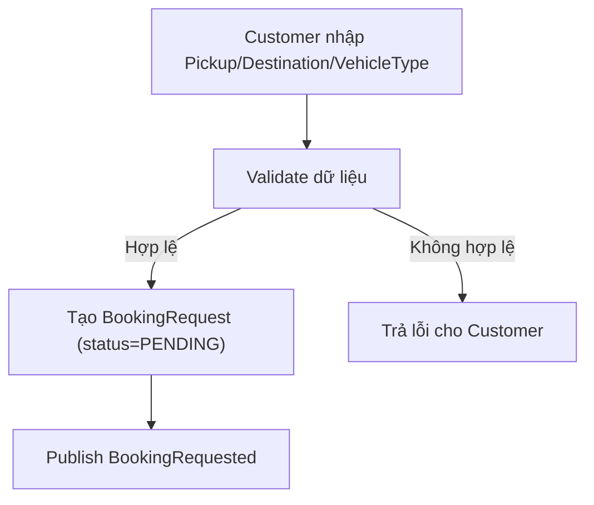
```mermaid
flowchart TD
    A["Customer nhập Pickup/Destination/VehicleType"] --> B["Validate dữ liệu"]
    B -->|"Hợp lệ"| C["Tạo BookingRequest (status=PENDING)"]
    C --> D["Publish BookingRequested"]
    B -->|"Không hợp lệ"| E["Trả lỗi cho Customer"]
```

### BC5 — Dispatch / Matching — *Core*
**FR:** FR-03.1→03.5, FR-04.1→04.5

**Ubiquitous Language:**
| Thuật ngữ | Định nghĩa |
|---|---|
| MatchingSession | Phiên tìm tài xế cho 1 BookingRequest |
| Candidate | Tài xế ứng viên (sẵn sàng, gần, đúng loại xe) |
| Offer | Đề nghị chuyến gửi tới 1 Driver, có timeout |
| Timeout/Reject | Tài xế không phản hồi/từ chối → tìm candidate kế tiếp |

**Workflow:**
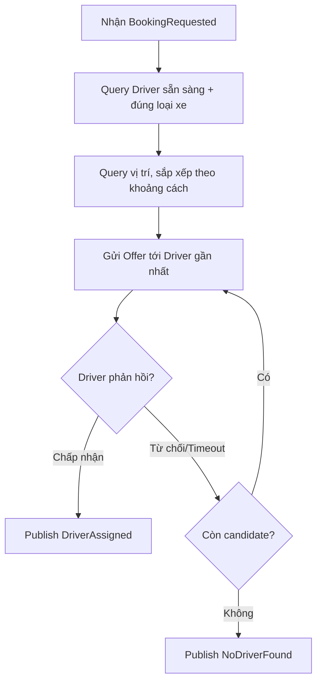
```mermaid
flowchart TD
    A["Nhận BookingRequested"] --> B["Query Driver sẵn sàng + đúng loại xe"]
    B --> C["Query vị trí, sắp xếp theo khoảng cách"]
    C --> D["Gửi Offer tới Driver gần nhất"]
    D --> E{"Driver phản hồi?"}
    E -->|"Chấp nhận"| F["Publish DriverAssigned"]
    E -->|"Từ chối/Timeout"| G{"Còn candidate?"}
    G -->|"Có"| D
    G -->|"Không"| H["Publish NoDriverFound"]
```

### BC6 — Location Tracking
**FR:** FR-06.1→06.4

**Ubiquitous Language:** DriverLocation (Lat/Long theo thời gian thực), ETA (thời gian dự kiến đến).

**Workflow:** Driver app gửi vị trí định kỳ → ghi đè vị trí hiện tại (geo-index) → Dispatch/Trip truy vấn để tìm tài xế gần & tính ETA.

### BC7 — Trip Management — *Core*
**FR:** FR-05.1→05.6

**Ubiquitous Language:**
| Thuật ngữ | Định nghĩa |
|---|---|
| Trip | Chuyến xe (vòng đời từ nhận chuyến → hoàn thành) |
| TripStatus | Đã nhận → Đã đến → Đã đón khách → Đang di chuyển → Hoàn thành |

**Workflow:**
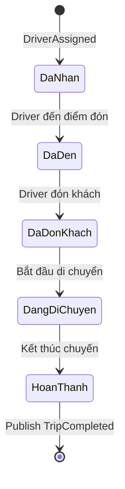
```mermaid
stateDiagram-v2
    [*] --> DaNhan: DriverAssigned
    DaNhan --> DaDen: Driver đến điểm đón
    DaDen --> DaDonKhach: Driver đón khách
    DaDonKhach --> DangDiChuyen: Bắt đầu di chuyển
    DangDiChuyen --> HoanThanh: Kết thúc chuyến
    HoanThanh --> [*]: Publish TripCompleted
```

### BC8 — Pricing / Fare
**FR:** FR-08.1

**Ubiquitous Language:** FareRule (công thức theo VehicleType/ServiceType), Fare (số tiền tính cho 1 Trip).

**Workflow:** Nhận `TripCompleted` → lấy khoảng cách/thời gian từ Trip → áp FareRule theo loại dịch vụ → publish `FareCalculated`.

### BC9 — Payment
**FR:** FR-08.2, FR-08.3, FR-08.4

**Ubiquitous Language:**
| Thuật ngữ | Định nghĩa |
|---|---|
| Payment | Giao dịch thanh toán 1 Trip |
| PaymentMethod | Tiền mặt / Điện tử |
| PaymentAttempt | Lần thử thanh toán (phục vụ retry) |
| TransactionID | Mã giao dịch từ Payment Provider bên ngoài |

**Workflow:**
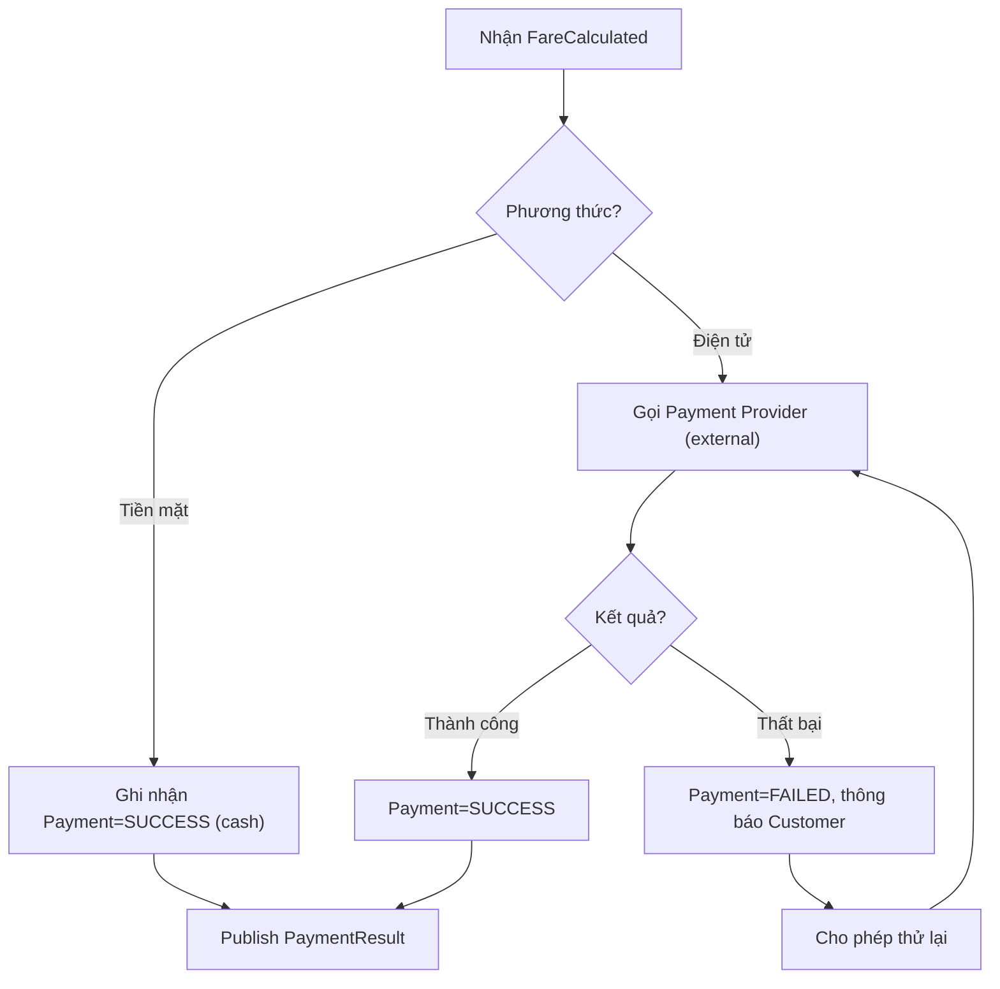
```mermaid
flowchart TD
    A["Nhận FareCalculated"] --> B{"Phương thức?"}
    B -->|"Tiền mặt"| C["Ghi nhận Payment=SUCCESS (cash)"]
    B -->|"Điện tử"| D["Gọi Payment Provider (external)"]
    D --> E{"Kết quả?"}
    E -->|"Thành công"| F["Payment=SUCCESS"]
    E -->|"Thất bại"| G["Payment=FAILED, thông báo Customer"]
    G --> H["Cho phép thử lại"] --> D
    C --> I["Publish PaymentResult"]
    F --> I
```
> BR-12/NFR-13: Không lưu số thẻ/tài khoản — chỉ lưu `TransactionID` tham chiếu tới Payment Provider.

### BC10 — Notification
**FR:** FR-09.1→09.4

**Ubiquitous Language:** Notification (bản tin gửi 1 User), Channel (SMS/Push/Email), Template.

**Workflow:** Subscribe các event (`BookingRequested`, `DriverAssigned`, `TripStatusChanged`, `PaymentResult`...) → render theo Template → gửi qua Channel → nếu lỗi → lưu trạng thái `FAILED` + retry, **không chặn** luồng nghiệp vụ chính (BR-22/NFR-07, EX-08).

### BC11 — Rating & Feedback
**FR:** FR-10.3

**Ubiquitous Language:** Rating (Score 1-5, Comment) gắn với 1 Trip đã Hoàn thành.

**Workflow:** Nhận `TripCompleted` → mở quyền đánh giá → Customer gửi Score/Comment → lưu Rating → (tuỳ chọn) publish `DriverRated` để Driver Context cập nhật điểm trung bình.

### BC12 — Trip History (CQRS read-model)
**FR:** FR-10.1, FR-10.2

**Ubiquitous Language:** TripHistoryView (bản ghi tổng hợp Trip + Fare + Payment để hiển thị nhanh cho Customer), Statement (sao kê).

**Workflow:** Subscribe `TripCompleted`, `FareCalculated`, `PaymentResult` → build/merge 1 document tổng hợp theo TripID → phục vụ API đọc nhanh (không join nhiều service khi Customer xem lịch sử).

### BC13 — Operations / Back-office
**FR:** FR-11.1→11.5

**Ubiquitous Language:** Incident (Case) — chuyến bị lỗi cần xử lý thủ công; Back-office Console.

**Workflow:** Operator xem danh sách Trip/Driver/Customer (qua Open Host API của các BC) → phát hiện lỗi → tạo `Incident` → cập nhật kết quả xử lý → (nếu cần) gọi API Trip/Payment để can thiệp (huỷ/hoàn tiền) với quyền phù hợp (BR-15/FR-13.2).

### BC14 — Reporting & Analytics
**FR:** FR-12.1→12.5

**Ubiquitous Language:** Fact (số liệu chuyến/doanh thu), Dimension (thời gian, tài xế, loại xe), Dashboard.

**Workflow:** Subscribe event từ Booking/Trip/Payment/Driver → ETL vào kho dữ liệu dạng cột (OLAP) → tổng hợp: số chuyến, doanh thu, tỷ lệ hoàn thành/huỷ, hiệu quả tài xế.

### BC15 — Audit Log
**FR:** FR-13.4

**Ubiquitous Language:** AuditLogEntry (Action, Actor, Timestamp, Description).

**Workflow:** Mọi BC publish sự kiện thao tác quan trọng (login, đổi quyền, huỷ chuyến, hoàn tiền…) → Audit Log service subscribe & lưu bất biến (append-only) phục vụ tra cứu khi có sự cố (BR-20, NFR-14).

---

## 5. Bảng ánh xạ Bounded Context → Microservice

| Bounded Context | Microservice | Giao tiếp chính | Loại CSDL | Lý do chọn |
|---|---|---|---|---|
| Identity & Access | `identity-service` | Sync (REST) — issue/verify JWT | **PostgreSQL** | Dữ liệu quan hệ (User–Role–Permission), cần ACID cho tài khoản/quyền |
| Customer Management | `customer-service` | Sync REST | **PostgreSQL** | Dữ liệu hồ sơ có cấu trúc, quan hệ đơn giản với User |
| Driver & Vehicle | `driver-service` | Sync REST + subscribe event | **PostgreSQL** | Quan hệ Driver–Vehicle rõ ràng, cần ràng buộc toàn vẹn |
| Booking | `booking-service` | Publish event (async) + REST tạo yêu cầu | **PostgreSQL** | Cần transaction đảm bảo trạng thái BookingRequest nhất quán |
| Dispatch/Matching | `dispatch-service` | Subscribe/publish event + REST query nội bộ | **Redis** (Geo + Streams) | Cần tốc độ cực nhanh (NFR-01/02), geospatial query (GEOSEARCH), dữ liệu phiên ngắn hạn |
| Location Tracking | `location-service` | Sync REST (ghi/đọc vị trí tần suất cao) | **Redis** (Geo) | Cập nhật vị trí real-time tần suất cao, cần GEO index, TTL |
| Trip Management | `trip-service` | Publish/subscribe event + REST | **PostgreSQL** | Vòng đời trạng thái cần nhất quán mạnh, hỗ trợ transaction & audit trạng thái |
| Pricing/Fare | `pricing-service` | Subscribe event + REST | **PostgreSQL** | Cấu hình FareRule dạng bảng, tính toán cần chính xác/nhất quán |
| Payment | `payment-service` | Subscribe event + REST (gọi Payment Provider ngoài) | **PostgreSQL** | Giao dịch tiền cần ACID tuyệt đối, hỗ trợ transaction/rollback |
| Notification | `notification-service` | Subscribe event (async) | **MongoDB** | Schema linh hoạt theo từng loại thông báo/kênh, ghi nhiều, không cần join phức tạp |
| Rating & Feedback | `rating-service` | Subscribe event + REST | **MongoDB** | Dữ liệu bán cấu trúc (Score + Comment tự do), đọc/ghi đơn giản, không cần transaction phức tạp |
| Trip History (CQRS) | `history-service` | Subscribe event (build read-model) + REST đọc | **MongoDB** | Document tổng hợp (denormalized) tối ưu cho truy vấn đọc nhanh |
| Operations/Back-office | `operations-service` | REST tổng hợp (BFF) + subscribe event | **PostgreSQL** | Entity Incident/Case có quan hệ, cần transaction khi cập nhật xử lý sự cố |
| Reporting & Analytics | `reporting-service` | Subscribe event (ETL) + REST đọc báo cáo | **ClickHouse** (OLAP) | Truy vấn tổng hợp/aggregate khối lượng lớn dữ liệu lịch sử, cột-hoá tối ưu cho phân tích |
| Audit Log | `audit-log-service` | Subscribe event (append-only) + REST tra cứu | **Elasticsearch** | Ghi liên tục, cần full-text/field search khi điều tra sự cố, không cần cập nhật |

> Giao tiếp bất đồng bộ dùng **Message Broker** (Kafka/RabbitMQ) — đáp ứng BR-22/NFR-06/NFR-07 (lỗi 1 service không chặn toàn hệ thống) và NFR-19 (triển khai từng phần). API Gateway đứng trước toàn bộ service để xác thực JWT tập trung (Open Host của `identity-service`).

---

## 6. Thiết kế chi tiết từng Microservice

### 6.1 `identity-service`
**Entities:** User, Role, Permission, RolePermission

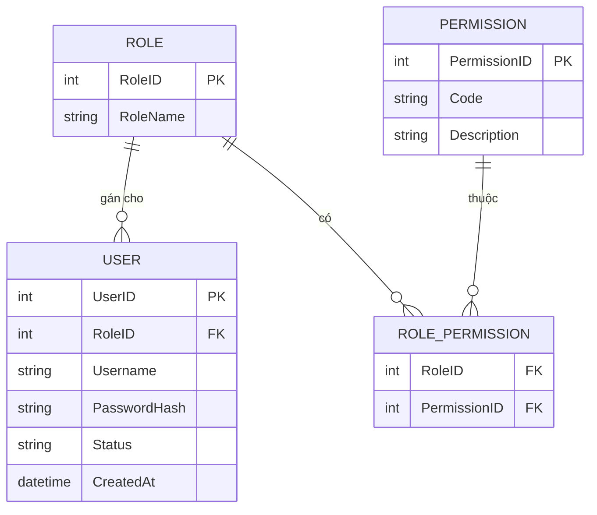
```mermaid
erDiagram
    ROLE ||--o{ USER : "gán cho"
    ROLE ||--o{ ROLE_PERMISSION : có
    PERMISSION ||--o{ ROLE_PERMISSION : thuộc

    ROLE { int RoleID PK
           string RoleName }
    PERMISSION { int PermissionID PK
                 string Code
                 string Description }
    ROLE_PERMISSION { int RoleID FK
                       int PermissionID FK }
    USER { int UserID PK
           int RoleID FK
           string Username
           string PasswordHash
           string Status
           datetime CreatedAt }
```

**API:**
| Method | Path | Mô tả |
|---|---|---|
| POST | `/api/v1/auth/register` | Tạo tài khoản (Customer/Driver) |
| POST | `/api/v1/auth/login` | Đăng nhập, trả JWT |
| POST | `/api/v1/auth/refresh` | Làm mới token |
| GET | `/api/v1/users/{userId}` | Lấy thông tin tài khoản |
| PATCH | `/api/v1/users/{userId}/status` | Khoá/mở tài khoản (Admin) |
| GET | `/api/v1/roles` | Danh sách Role |
| POST | `/api/v1/roles/{roleId}/permissions` | Gán quyền cho Role (Admin) |

---

### 6.2 `customer-service`
**Entities:** Customer

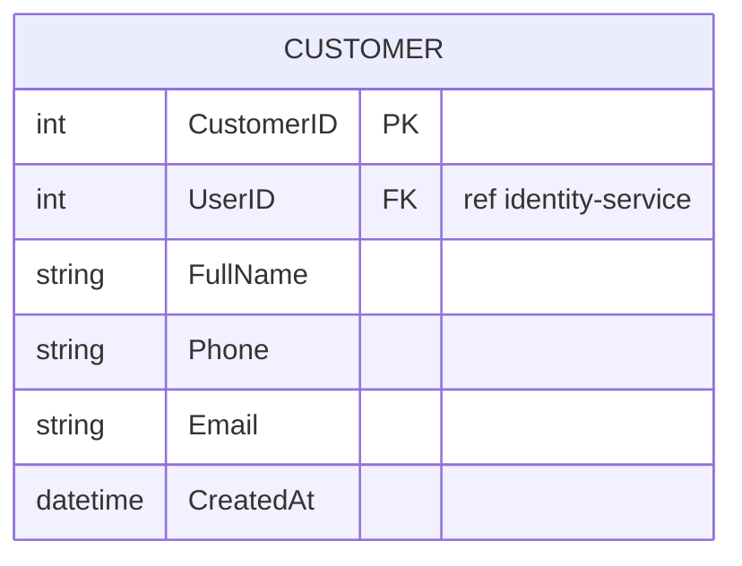
```mermaid
erDiagram
    CUSTOMER {
        int CustomerID PK
        int UserID FK "ref identity-service"
        string FullName
        string Phone
        string Email
        datetime CreatedAt
    }
```

**API:**
| Method | Path | Mô tả |
|---|---|---|
| POST | `/api/v1/customers` | Tạo hồ sơ khách hàng (sau khi đăng ký) |
| GET | `/api/v1/customers/{customerId}` | Xem hồ sơ |
| PUT | `/api/v1/customers/{customerId}` | Cập nhật thông tin cá nhân |
| GET | `/api/v1/customers?userId=` | Tra cứu theo UserID (nội bộ) |

---

### 6.3 `driver-service`
**Entities:** Driver, Vehicle, VehicleType

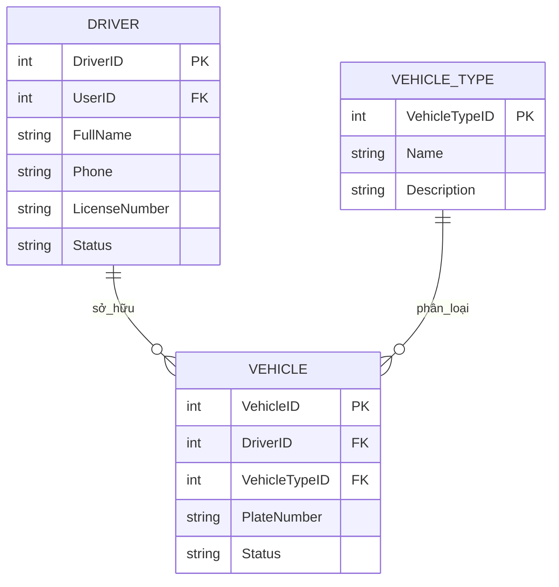
```mermaid
erDiagram
    DRIVER ||--o{ VEHICLE : sở_hữu
    VEHICLE_TYPE ||--o{ VEHICLE : phân_loại

    DRIVER { int DriverID PK
             int UserID FK
             string FullName
             string Phone
             string LicenseNumber
             string Status }
    VEHICLE_TYPE { int VehicleTypeID PK
                   string Name
                   string Description }
    VEHICLE { int VehicleID PK
              int DriverID FK
              int VehicleTypeID FK
              string PlateNumber
              string Status }
```

**API:**
| Method | Path | Mô tả |
|---|---|---|
| POST | `/api/v1/drivers` | Tạo tài khoản tài xế (Driver/Operator) |
| GET | `/api/v1/drivers/{driverId}` | Xem hồ sơ tài xế |
| PUT | `/api/v1/drivers/{driverId}` | Cập nhật hồ sơ |
| PATCH | `/api/v1/drivers/{driverId}/status` | Đổi trạng thái sẵn sàng/offline |
| POST | `/api/v1/drivers/{driverId}/vehicles` | Thêm phương tiện |
| PUT | `/api/v1/vehicles/{vehicleId}` | Cập nhật phương tiện |
| GET | `/api/v1/drivers?status=AVAILABLE&vehicleTypeId=` | Truy vấn nội bộ cho Dispatch |

---

### 6.4 `booking-service`
**Entities:** BookingRequest

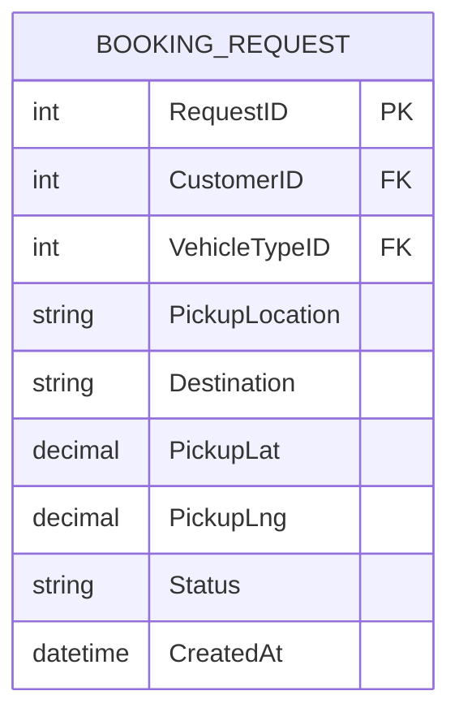
```mermaid
erDiagram
    BOOKING_REQUEST {
        int RequestID PK
        int CustomerID FK
        int VehicleTypeID FK
        string PickupLocation
        string Destination
        decimal PickupLat
        decimal PickupLng
        string Status
        datetime CreatedAt
    }
```

**API:**
| Method | Path | Mô tả |
|---|---|---|
| POST | `/api/v1/bookings` | Tạo yêu cầu đặt xe (→ publish `BookingRequested`) |
| GET | `/api/v1/bookings/{requestId}` | Xem chi tiết yêu cầu |
| GET | `/api/v1/customers/{customerId}/bookings` | Danh sách yêu cầu của khách hàng |
| PATCH | `/api/v1/bookings/{requestId}/cancel` | Huỷ yêu cầu |
| (internal) PATCH | `/internal/bookings/{requestId}/status` | Cập nhật trạng thái khi có `DriverAssigned`/`NoDriverFound` |

---

### 6.5 `dispatch-service`
**Entities (Redis structures, mô hình logic):** MatchingSession, Offer

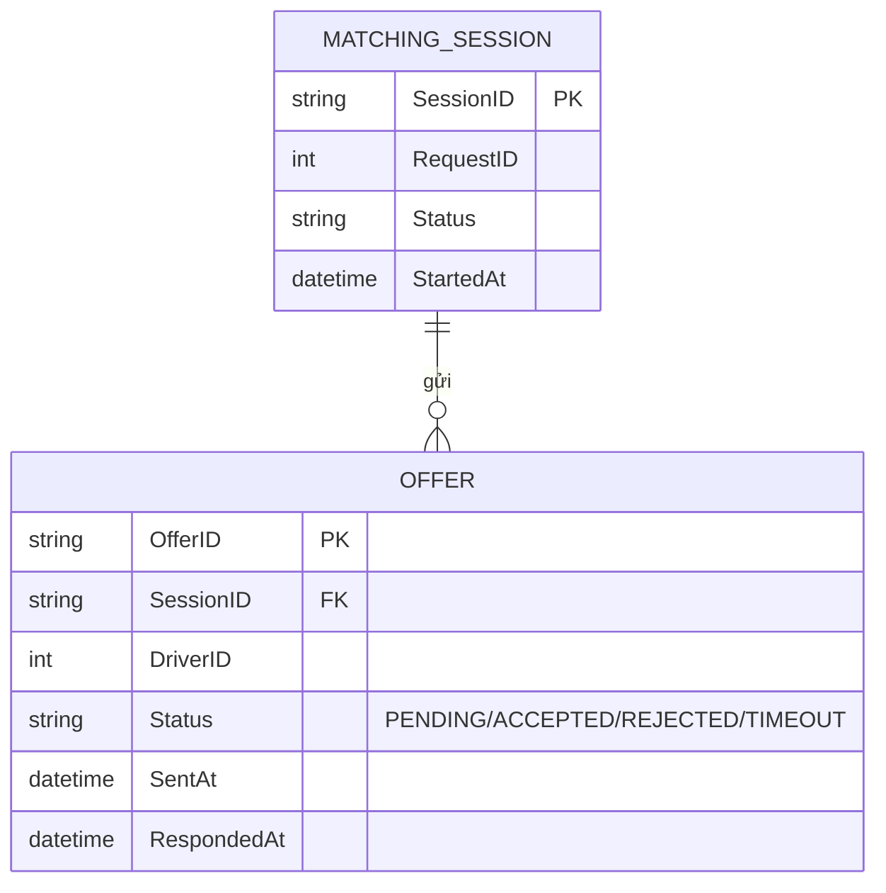
```mermaid
erDiagram
    MATCHING_SESSION ||--o{ OFFER : "gửi"
    MATCHING_SESSION {
        string SessionID PK
        int RequestID
        string Status
        datetime StartedAt
    }
    OFFER {
        string OfferID PK
        string SessionID FK
        int DriverID
        string Status "PENDING/ACCEPTED/REJECTED/TIMEOUT"
        datetime SentAt
        datetime RespondedAt
    }
```
*(Lưu trong Redis Hash/Sorted Set + TTL; có thể ghi log bất đồng bộ sang `audit-log-service`/`reporting-service` để phân tích lâu dài.)*

**API:**
| Method | Path | Mô tả |
|---|---|---|
| (event) subscribe | `BookingRequested` | Bắt đầu MatchingSession |
| GET | `/api/v1/dispatch/{requestId}/status` | Xem trạng thái tìm tài xế |
| POST | `/api/v1/dispatch/offers/{offerId}/accept` | Driver chấp nhận chuyến |
| POST | `/api/v1/dispatch/offers/{offerId}/reject` | Driver từ chối chuyến |
| (internal) | timeout worker | Tự chuyển Offer hết hạn sang tài xế kế tiếp |
| (event) publish | `DriverAssigned` / `NoDriverFound` | Kết quả matching |

---

### 6.6 `location-service`
**Entities:** DriverLocation

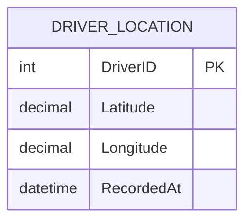
```mermaid
erDiagram
    DRIVER_LOCATION {
        int DriverID PK
        decimal Latitude
        decimal Longitude
        datetime RecordedAt
    }
```

**API:**
| Method | Path | Mô tả |
|---|---|---|
| PUT | `/api/v1/locations/{driverId}` | Driver app cập nhật vị trí (tần suất cao) |
| GET | `/api/v1/locations/{driverId}` | Vị trí hiện tại |
| GET | `/api/v1/locations/nearby?lat=&lng=&radius=&vehicleTypeId=` | Tìm tài xế gần (dùng bởi Dispatch) |
| GET | `/api/v1/locations/{driverId}/eta?destinationLat=&destinationLng=` | Ước tính thời gian đến |

---

### 6.7 `trip-service`
**Entities:** Trip, TripStatusHistory

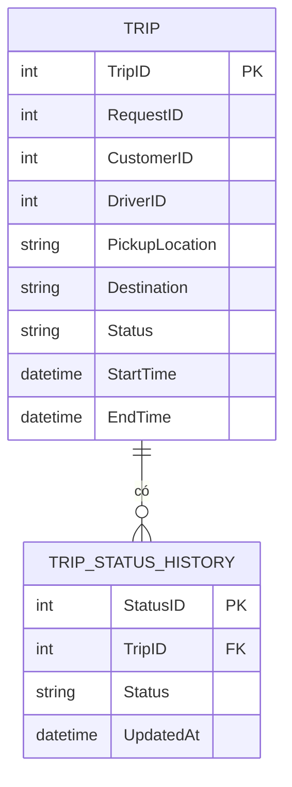
```mermaid
erDiagram
    TRIP ||--o{ TRIP_STATUS_HISTORY : có
    TRIP {
        int TripID PK
        int RequestID
        int CustomerID
        int DriverID
        string PickupLocation
        string Destination
        string Status
        datetime StartTime
        datetime EndTime
    }
    TRIP_STATUS_HISTORY {
        int StatusID PK
        int TripID FK
        string Status
        datetime UpdatedAt
    }
```

**API:**
| Method | Path | Mô tả |
|---|---|---|
| (event) subscribe | `DriverAssigned` | Tạo Trip mới |
| PATCH | `/api/v1/trips/{tripId}/status` | Driver cập nhật trạng thái (đã đến/đã đón/di chuyển/hoàn thành) |
| GET | `/api/v1/trips/{tripId}` | Xem chi tiết + trạng thái hiện tại |
| GET | `/api/v1/trips/{tripId}/history` | Lịch sử thay đổi trạng thái |
| GET | `/api/v1/customers/{customerId}/trips/current` | Chuyến đang thực hiện (theo dõi real-time) |
| (event) publish | `TripStatusChanged`, `TripCompleted` | Cho Notification/Pricing/Rating/History |

---

### 6.8 `pricing-service`
**Entities:** Fare, FareRule

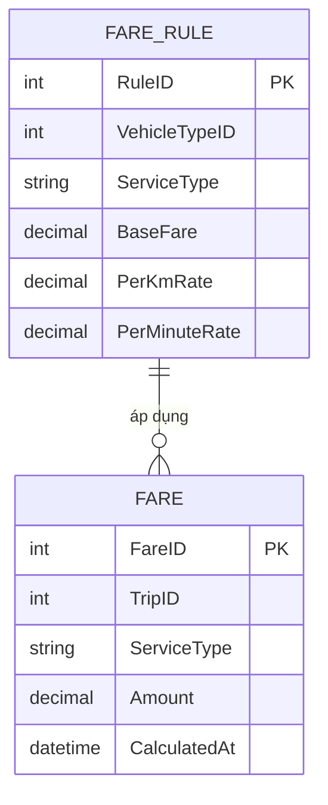
```mermaid
erDiagram
    FARE_RULE ||--o{ FARE : "áp dụng"
    FARE_RULE {
        int RuleID PK
        int VehicleTypeID
        string ServiceType
        decimal BaseFare
        decimal PerKmRate
        decimal PerMinuteRate
    }
    FARE {
        int FareID PK
        int TripID
        string ServiceType
        decimal Amount
        datetime CalculatedAt
    }
```

**API:**
| Method | Path | Mô tả |
|---|---|---|
| (event) subscribe | `TripCompleted` | Trigger tính cước |
| GET | `/api/v1/fares/{tripId}` | Xem cước đã tính |
| GET | `/api/v1/fare-rules` | Danh sách quy tắc giá (Admin) |
| POST/PUT | `/api/v1/fare-rules` | Cấu hình FareRule (Admin) |
| (event) publish | `FareCalculated` | Cho Payment/History |

---

### 6.9 `payment-service`
**Entities:** Payment, PaymentAttempt

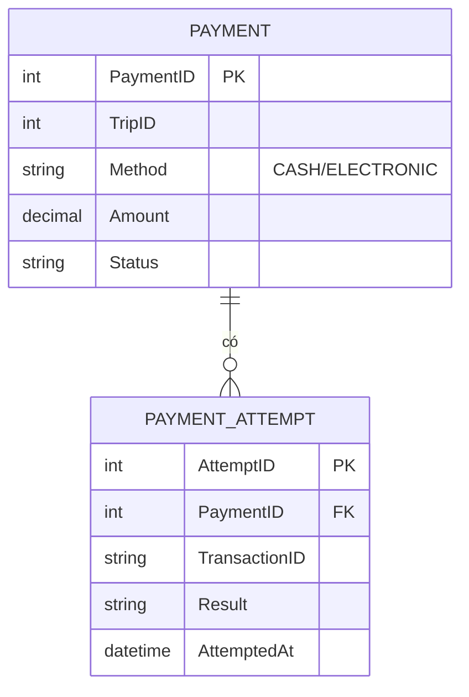
```mermaid
erDiagram
    PAYMENT ||--o{ PAYMENT_ATTEMPT : có
    PAYMENT {
        int PaymentID PK
        int TripID
        string Method "CASH/ELECTRONIC"
        decimal Amount
        string Status
    }
    PAYMENT_ATTEMPT {
        int AttemptID PK
        int PaymentID FK
        string TransactionID
        string Result
        datetime AttemptedAt
    }
```

**API:**
| Method | Path | Mô tả |
|---|---|---|
| (event) subscribe | `FareCalculated` | Khởi tạo Payment |
| POST | `/api/v1/payments/{tripId}/pay` | Khách chọn phương thức & xác nhận thanh toán |
| POST | `/api/v1/payments/{tripId}/retry` | Thanh toán lại khi thất bại |
| GET | `/api/v1/payments/{tripId}` | Xem trạng thái thanh toán |
| POST | `/api/v1/payments/webhook` | Callback kết quả từ Payment Provider ngoài |
| (event) publish | `PaymentResult` (SUCCESS/FAILED) | Cho Notification/History/Reporting |

---

### 6.10 `notification-service`
**Entities:** Notification, NotificationTemplate

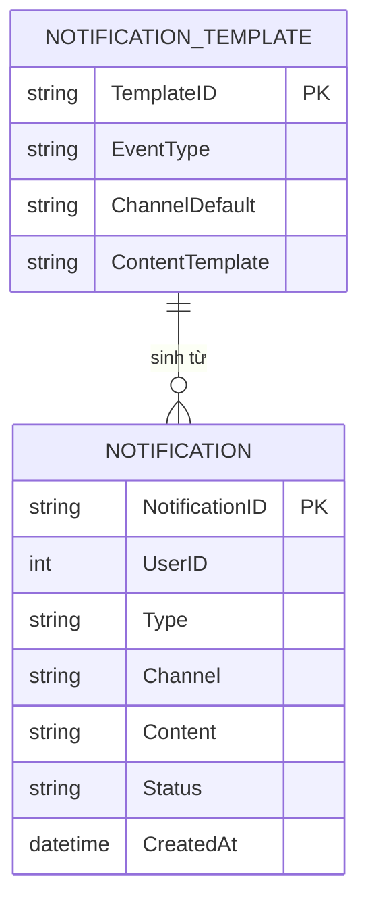
```mermaid
erDiagram
    NOTIFICATION_TEMPLATE ||--o{ NOTIFICATION : "sinh từ"
    NOTIFICATION_TEMPLATE {
        string TemplateID PK
        string EventType
        string ChannelDefault
        string ContentTemplate
    }
    NOTIFICATION {
        string NotificationID PK
        int UserID
        string Type
        string Channel
        string Content
        string Status
        datetime CreatedAt
    }
```

**API:**
| Method | Path | Mô tả |
|---|---|---|
| (event) subscribe | `BookingRequested/DriverAssigned/TripStatusChanged/PaymentResult...` | Trigger gửi thông báo |
| GET | `/api/v1/notifications/{userId}` | Danh sách thông báo của user |
| POST | `/api/v1/notifications/{notificationId}/retry` | Gửi lại thông báo lỗi |
| GET | `/api/v1/notifications/templates` | Quản lý template (Admin) |

---

### 6.11 `rating-service`
**Entities:** Rating

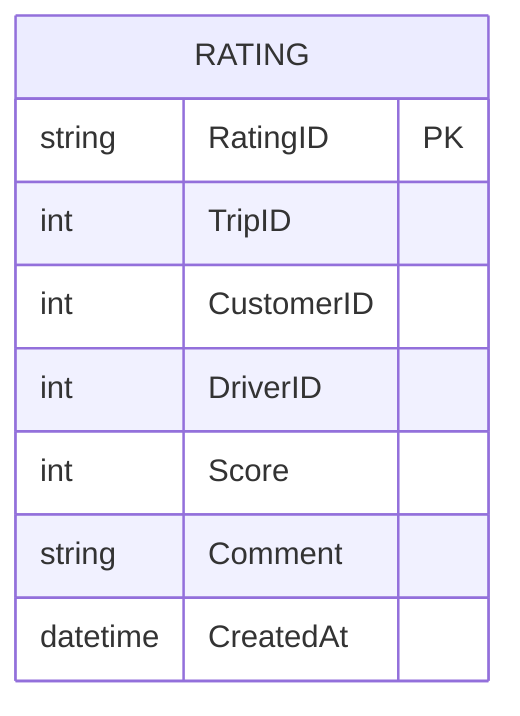
```mermaid
erDiagram
    RATING {
        string RatingID PK
        int TripID
        int CustomerID
        int DriverID
        int Score
        string Comment
        datetime CreatedAt
    }
```

**API:**
| Method | Path | Mô tả |
|---|---|---|
| POST | `/api/v1/ratings` | Khách hàng gửi đánh giá (chỉ khi `TripCompleted`) |
| GET | `/api/v1/drivers/{driverId}/ratings` | Danh sách đánh giá của tài xế |
| GET | `/api/v1/drivers/{driverId}/rating-summary` | Điểm trung bình |

---

### 6.12 `history-service`
**Entities:** TripHistoryView (document tổng hợp)

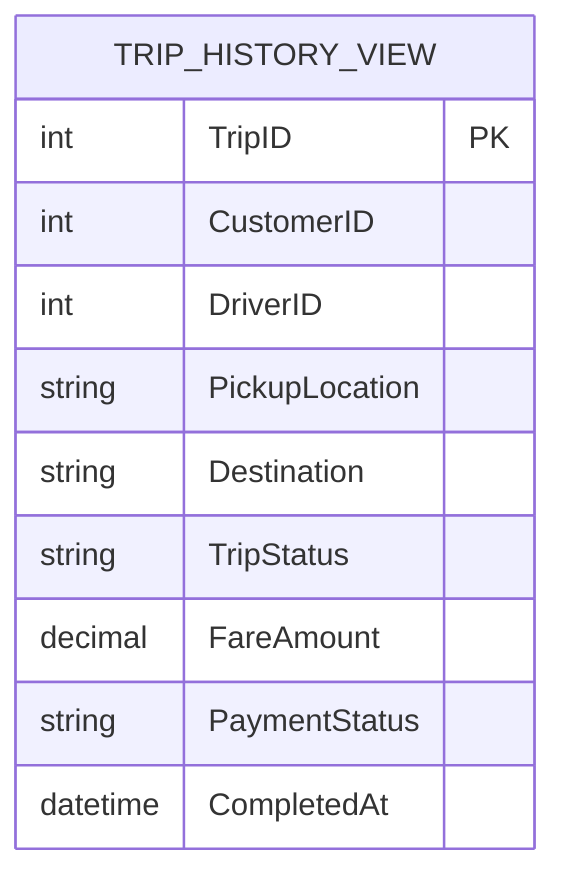
```mermaid
erDiagram
    TRIP_HISTORY_VIEW {
        int TripID PK
        int CustomerID
        int DriverID
        string PickupLocation
        string Destination
        string TripStatus
        decimal FareAmount
        string PaymentStatus
        datetime CompletedAt
    }
```

**API:**
| Method | Path | Mô tả |
|---|---|---|
| (event) subscribe | `TripCompleted`, `FareCalculated`, `PaymentResult` | Cập nhật document tổng hợp |
| GET | `/api/v1/customers/{customerId}/history` | Danh sách lịch sử chuyến (phân trang) |
| GET | `/api/v1/customers/{customerId}/statements/{tripId}` | Chi tiết 1 chuyến + số tiền đã trả |

---

### 6.13 `operations-service`
**Entities:** Incident, IncidentNote

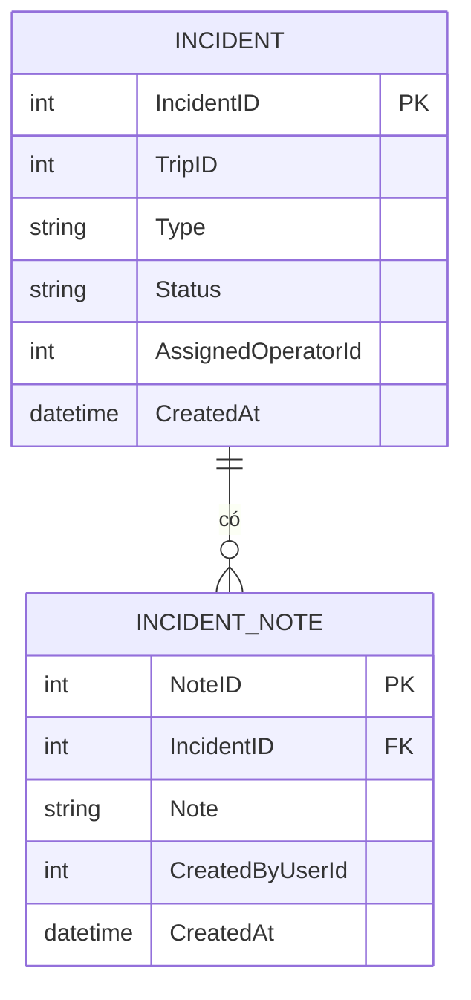
```mermaid
erDiagram
    INCIDENT ||--o{ INCIDENT_NOTE : có
    INCIDENT {
        int IncidentID PK
        int TripID
        string Type
        string Status
        int AssignedOperatorId
        datetime CreatedAt
    }
    INCIDENT_NOTE {
        int NoteID PK
        int IncidentID FK
        string Note
        int CreatedByUserId
        datetime CreatedAt
    }
```

**API:**
| Method | Path | Mô tả |
|---|---|---|
| GET | `/api/v1/ops/customers` | Danh sách/tra cứu khách hàng (proxy → customer-service) |
| GET | `/api/v1/ops/drivers` | Danh sách/tra cứu tài xế (proxy → driver-service) |
| GET | `/api/v1/ops/trips?status=` | Xem chuyến đang diễn ra/có sự cố (proxy → trip-service) |
| POST | `/api/v1/ops/incidents` | Tạo Incident cho chuyến lỗi |
| PATCH | `/api/v1/ops/incidents/{incidentId}` | Cập nhật xử lý sự cố |
| POST | `/api/v1/ops/incidents/{incidentId}/notes` | Ghi chú xử lý |

---

### 6.14 `reporting-service`
**Entities (star schema, OLAP):** TripFact, RevenueFact, DriverPerformanceFact + Dimension (Time, VehicleType, Driver)

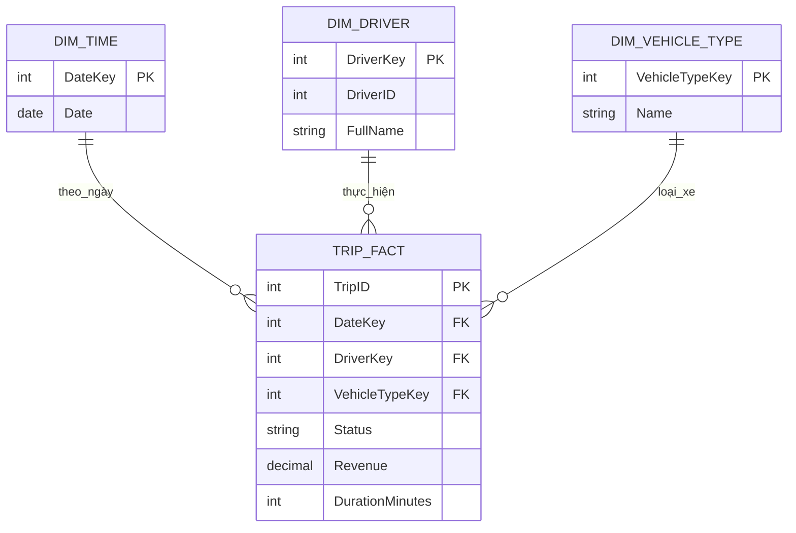
```mermaid
erDiagram
    DIM_TIME ||--o{ TRIP_FACT : theo_ngày
    DIM_DRIVER ||--o{ TRIP_FACT : thực_hiện
    DIM_VEHICLE_TYPE ||--o{ TRIP_FACT : loại_xe

    TRIP_FACT {
        int TripID PK
        int DateKey FK
        int DriverKey FK
        int VehicleTypeKey FK
        string Status
        decimal Revenue
        int DurationMinutes
    }
    DIM_TIME { int DateKey PK
               date Date }
    DIM_DRIVER { int DriverKey PK
                 int DriverID
                 string FullName }
    DIM_VEHICLE_TYPE { int VehicleTypeKey PK
                        string Name }
```

**API:**
| Method | Path | Mô tả |
|---|---|---|
| (event) subscribe | `TripCompleted`, `PaymentResult`, `BookingRequested` | ETL nạp Fact |
| GET | `/api/v1/reports/trips-count?from=&to=` | Số lượng chuyến |
| GET | `/api/v1/reports/revenue?from=&to=` | Doanh thu |
| GET | `/api/v1/reports/completion-rate?from=&to=` | Tỷ lệ hoàn thành/huỷ |
| GET | `/api/v1/reports/drivers/{driverId}/performance` | Hiệu quả tài xế |

---

### 6.15 `audit-log-service`
**Entities:** AuditLogEntry

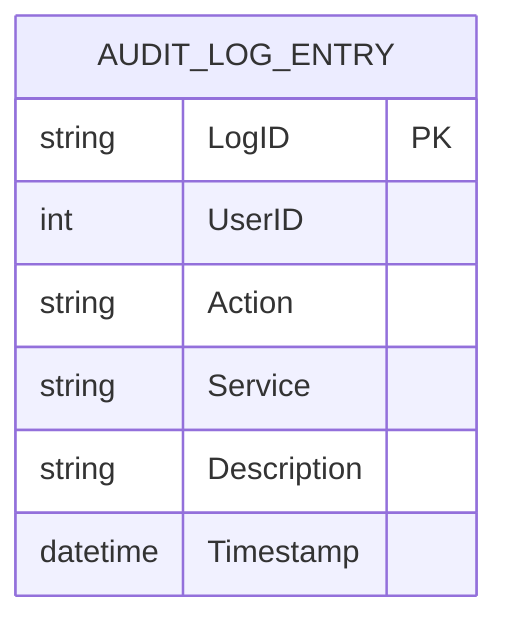
```mermaid
erDiagram
    AUDIT_LOG_ENTRY {
        string LogID PK
        int UserID
        string Action
        string Service
        string Description
        datetime Timestamp
    }
```

**API:**
| Method | Path | Mô tả |
|---|---|---|
| (event) subscribe | mọi domain event có gắn "quan trọng" (login, đổi quyền, huỷ/hoàn tiền, sửa dữ liệu nhạy cảm) | Ghi log bất biến |
| GET | `/api/v1/audit-logs?userId=&from=&to=&action=` | Tra cứu log (Admin/Operator có quyền) |
| GET | `/api/v1/audit-logs/{logId}` | Chi tiết 1 log |

---

## 7. Saga tổng thể — quy trình đặt xe end-to-end (Choreography-based)

```mermaid
sequenceDiagram
    participant C as Customer
    participant BOOK as booking-service
    participant DISP as dispatch-service
    participant DRV as driver-service
    participant LOC as location-service
    participant TRIP as trip-service
    participant PRICE as pricing-service
    participant PAY as payment-service
    participant NOTI as notification-service
    participant HIST as history-service

    C->>BOOK: POST /bookings
    BOOK-->>BOOK: publish BookingRequested
    DISP->>DRV: query driver sẵn sàng
    DISP->>LOC: query vị trí gần
    DISP->>DRV: gửi Offer (accept/reject)
    DISP-->>TRIP: publish DriverAssigned
    TRIP-->>NOTI: publish TripStatusChanged (nhiều lần)
    TRIP-->>PRICE: publish TripCompleted
    PRICE-->>PAY: publish FareCalculated
    PAY-->>NOTI: publish PaymentResult
    PAY-->>HIST: publish PaymentResult
    TRIP-->>HIST: publish TripCompleted
    NOTI-->>C: thông báo tại từng mốc
```

Mỗi bước **thất bại cục bộ** (payment lỗi, notification lỗi) chỉ kích hoạt **compensating action** trong chính BC đó (retry thanh toán, retry thông báo) — không rollback toàn saga, đúng với BR-22/NFR-06/NFR-07 (cô lập lỗi) và EX-06/EX-08.

## 8. Hạ tầng chung (cross-cutting)
- **API Gateway**: xác thực JWT (từ `identity-service`), routing, rate-limit.
- **Message Broker** (Kafka/RabbitMQ): trục truyền domain event giữa các BC — đáp ứng NFR-19 (triển khai từng phần) & NFR-04 (mở rộng độc lập).
- **Service Discovery / Config Server**: hỗ trợ scale từng service độc lập (NFR-03/04).
- **Observability**: mỗi service log ra Audit Log/Reporting, dùng traceId xuyên suốt saga để debug.

