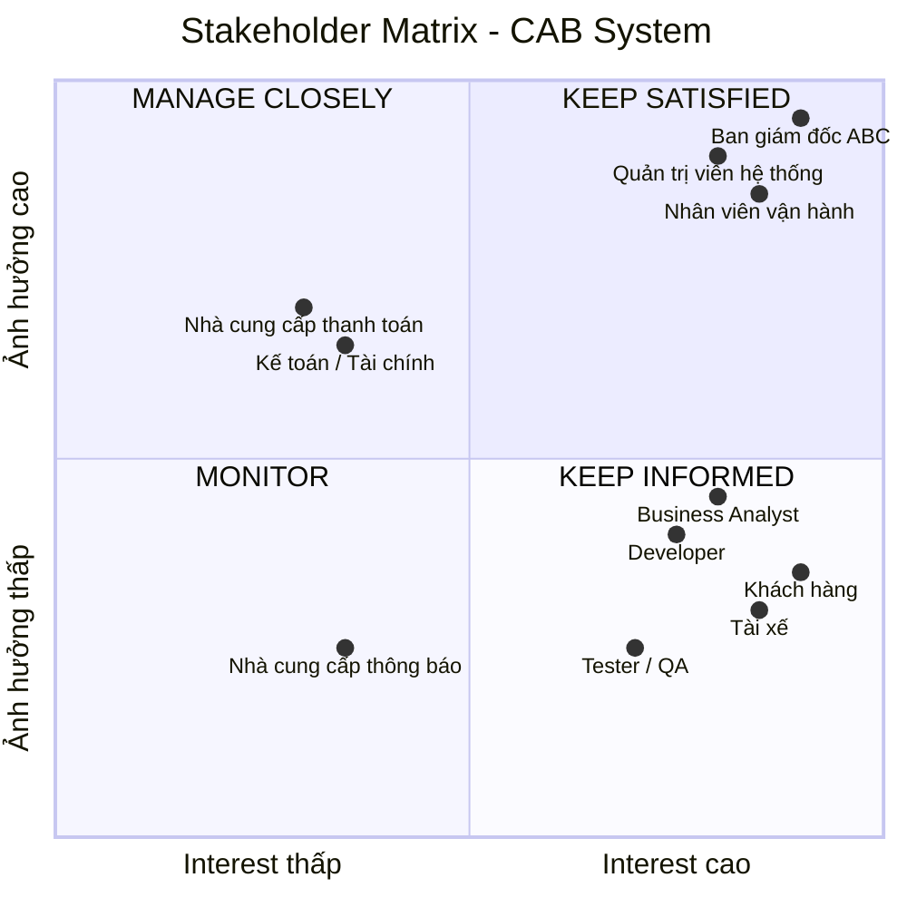
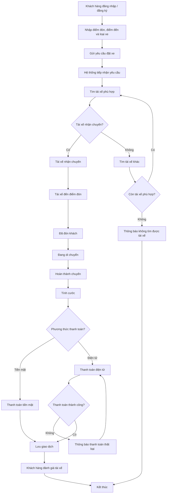
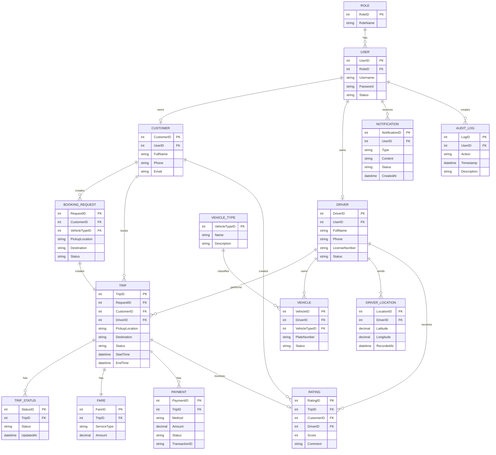
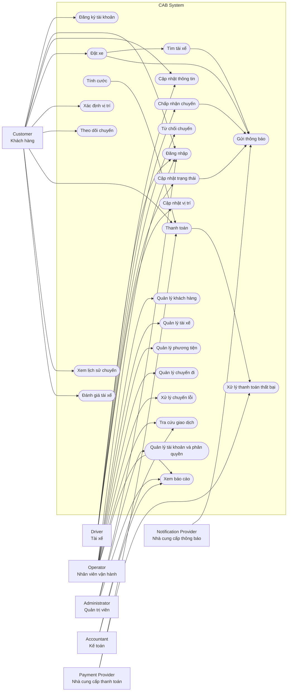

## B1. BUSINESS CONTEXT

### 1. Doanh nghiệp

**Công ty:** ABC  
**Lĩnh vực:** Cung cấp dịch vụ đặt xe trực tuyến.

### 2. Hiện trạng vận hành

- Khách hàng đặt xe qua **2 kênh**:
  - Gọi tổng đài.
  - Sử dụng ứng dụng đơn giản.

- Việc **phân công tài xế** cho chuyến đi hiện được thực hiện thủ công:
  - Nhân viên vận hành trực tiếp điều phối tài xế.
  - Chưa có thuật toán tự động ghép tài xế với khách hàng.
  - Khó tìm tài xế phù hợp khi số lượng chuyến tăng cao.

- **Hệ thống thanh toán** chưa được quản lý tập trung:
  - Thông tin giao dịch có thể bị phân tán theo từng kênh.
  - Khó theo dõi và tra cứu lịch sử giao dịch.
  - Khó xử lý khi giao dịch thanh toán thất bại.

- **Nhu cầu phát triển của doanh nghiệp:**
  - Mở rộng số lượng khách hàng.
  - Mở rộng số lượng tài xế.
  - Bổ sung các tính năng mới trong tương lai.
  - Xây dựng nền tảng có khả năng mở rộng và phát triển lâu dài.
2. Business Problem
  1. Phân công tài xế thủ công
    Khó tìm tài xế gần khách hàng.
    Mất thời gian xử lý.
    Nếu tài xế từ chối → phải tìm người khác.
    Khó tối ưu khi số lượng chuyến tăng cao.
  2. Khách hàng khó theo dõi chuyến
    Không biết hệ thống đang tìm tài xế hay chưa.
    Không biết tài xế nào nhận chuyến.
    Khó biết thời gian tài xế đến.
    Thiếu thông tin trạng thái chuyến theo thời gian thực
  3. Thanh toán chưa được quản lý tập trung
    Khó quản lý lịch sử giao dịch.
    Khó xử lý giao dịch thất bại.
    Chưa có cơ chế tích hợp thanh toán điện tử linh hoạt
  4. Quản lý vận hành khó khăn
    Dữ liệu khách hàng, tài xế, phương tiện, chuyến đi chưa được quản lý hiệu quả.
    Khó xử lý các chuyến bị lỗi.
    Khó tra cứu lịch sử.

B2.BẢNG STAKEHOLDER VÀ VAI TRÒ

| Stakeholder | Vai trò |
|---|---|
| Ban giám đốc ABC | Định hướng kinh doanh, xác định mục tiêu và phê duyệt dự án |
| Khách hàng | Đăng ký tài khoản, đặt xe, theo dõi chuyến đi, thanh toán và đánh giá tài xế |
| Tài xế | Nhận/từ chối chuyến, thực hiện chuyến và cập nhật trạng thái chuyến đi |
| Nhân viên vận hành | Quản lý khách hàng, tài xế, phương tiện, chuyến đi và xử lý sự cố |
| Quản trị viên hệ thống | Quản lý tài khoản, phân quyền và cấu hình hệ thống |
| Bộ phận kế toán/tài chính | Theo dõi doanh thu, giao dịch và đối soát thanh toán |
| Business Analyst (BA) | Thu thập, phân tích và làm rõ yêu cầu của các bên liên quan |
| Developer | Thiết kế, xây dựng và triển khai hệ thống CAB |
| Tester/QA | Kiểm thử hệ thống, phát hiện lỗi và đảm bảo chất lượng |
| Nhà cung cấp thanh toán | Xử lý các giao dịch thanh toán điện tử |
| Nhà cung cấp dịch vụ thông báo | Cung cấp và gửi thông báo đến khách hàng, tài xế |

## B2. Stakeholder Matrix – Mức độ ảnh hưởng

B3.## Business Goals
| Mã | Business Goal |
|---|---|
| BG-01 | Tự động hóa quy trình đặt xe và phân công tài xế, giảm sự phụ thuộc vào thao tác thủ công |
| BG-02 | Nâng cao trải nghiệm khách hàng thông qua khả năng theo dõi trạng thái chuyến đi theo thời gian thực |
| BG-03 | Tập trung quản lý thông tin khách hàng, tài xế, phương tiện, chuyến đi và giao dịch |
| BG-04 | Tích hợp thanh toán điện tử an toàn và hỗ trợ nhiều phương thức thanh toán |
| BG-05 | Nâng cao hiệu quả vận hành thông qua quản lý và giám sát chuyến đi tập trung |
| BG-06 | Cung cấp báo cáo về số lượng chuyến, doanh thu, tỷ lệ hoàn thành, tỷ lệ hủy và hiệu quả tài xế |
| BG-07 | Đảm bảo hệ thống có khả năng mở rộng khi số lượng khách hàng và tài xế tăng |
| BG-08 | Xây dựng kiến trúc linh hoạt để dễ dàng bổ sung dịch vụ, phương thức thanh toán và kênh thông báo mới |
| BG-09 | Tăng cường bảo mật dữ liệu cá nhân, dữ liệu vị trí và dữ liệu giao dịch |
| BG-10 | Giảm ảnh hưởng của lỗi ở một thành phần như thanh toán hoặc thông báo đến toàn bộ hệ thống |
B4.XÁC ĐỊNH PHẠM VI (SCOPE)
1. Đối với Khách hàng
  Đăng ký, đăng nhập, cập nhật thông tin cá nhân
  Nhập điểm đón, điểm đến, chọn loại xe
  Gửi yêu cầu đặt xe, theo dõi trạng thái chuyến (đang tìm tài xế, tài xế đã nhận, thời gian dự kiến đến, trạng thái hiện tại)
  Xem lịch sử chuyến đi, số tiền phải trả
  Đánh giá tài xế sau khi hoàn thành chuyến
2. Đối với Tài xế
  Đăng ký hoặc được nhân viên vận hành tạo tài khoản
  Cập nhật hồ sơ, thông tin phương tiện, trạng thái hoạt động
  Chuyển trạng thái sẵn sàng nhận chuyến
  Nhận thông báo, chấp nhận hoặc từ chối chuyến
  Cập nhật trạng thái chuyến: đã đến điểm đón, đã đón khách, đang di chuyển, hoàn thành
  Lưu vị trí tài xế (hỗ trợ tìm tài xế gần khách hàng, dự kiến thời gian đến)
3. Tìm và phân công tài xế
   Xác định tài xế phù hợp dựa trên vị trí, trạng thái sẵn sàng, tiêu chí vận hành
  Cơ chế tìm tài xế khác khi tài xế đầu tiên không phản hồi/từ chối
  Thông báo cho khách hàng khi không tìm được tài xế
4. Thanh toán và tính cước
  Tính số tiền khách hàng phải trả sau khi hoàn thành chuyến
   Hỗ trợ thanh toán tiền mặt và thanh toán điện tử (tích hợp nhà cung cấp bên ngoài)
  Không lưu trực tiếp thông tin nhạy cảm thẻ/tài khoản thanh toán trong hệ thống CAB
  Thông báo và cho xử lý lại khi giao dịch điện tử thất bại
5. Thông báo
  Thông báo cho khách hàng: tiếp nhận yêu cầu, tài xế nhận chuyến, tài xế đến điểm đón, hoàn thành chuyến, kết quả thanh toán
  Thông báo cho tài xế: chuyến mới, thay đổi liên quan chuyến đang thực hiện
6. Nhân viên vận hành (quản trị)
  Quản lý khách hàng, tài xế, phương tiện, chuyến đi
  Xem chuyến đang diễn ra, kiểm tra trạng thái tài xế
  Xử lý chuyến bị lỗi, tra cứu lịch sử giao dịch
  Phân quyền: một số chức năng nhạy cảm chỉ dành cho vai trò cao hơn
  Xem báo cáo: số lượng chuyến, doanh thu, tỷ lệ hoàn thành, tỷ lệ hủy, hiệu quả tài xế
7. Yêu cầu phi chức năng liên quan scope
  Hệ thống ổn định khi nhu cầu tăng cao
  Lỗi ở thanh toán/thông báo không làm ngừng toàn bộ hệ thống đặt xe
  Các thành phần mở rộng độc lập khi tải tăng
  Triển khai tính năng mới từng phần, hạn chế ảnh hưởng chức năng đang hoạt động
  Xác thực khách hàng/tài xế trước khi dùng chức năng cần tài khoản
  Kiểm soát quyền truy cập cho thao tác quản trị
  Bảo vệ thông tin cá nhân, phương tiện, vị trí, giao dịch
  Lưu vết các thao tác quan trọng

B5. Business Requirements (BR)

| BR-ID | Tên (Đối tượng nghiệp vụ) | Mô tả yêu cầu nghiệp vụ |
|---|---|---|
| BR-01 | Chuyến xe (Trip) | Hệ thống phải quản lý toàn bộ vòng đời một chuyến xe: từ khi khách hàng tạo yêu cầu, tìm tài xế, tài xế nhận chuyến, thực hiện chuyến, đến khi hoàn thành và thanh toán |
| BR-02 | Tài khoản khách hàng | Hệ thống phải cho phép khách hàng đăng ký, đăng nhập, cập nhật thông tin cá nhân trước khi sử dụng dịch vụ đặt xe |
| BR-03 | Tài khoản tài xế | Hệ thống phải cho phép tài xế đăng ký hoặc được nhân viên vận hành tạo tài khoản, cập nhật hồ sơ và thông tin phương tiện |
| BR-04 | Yêu cầu đặt xe | Hệ thống phải cho phép khách hàng nhập điểm đón, điểm đến, chọn loại xe và gửi yêu cầu đặt xe |
| BR-05 | Phân công tài xế (Matching) | Hệ thống phải tự động tìm và phân công tài xế phù hợp dựa trên vị trí, trạng thái sẵn sàng, thay thế cho quy trình thủ công hiện tại |
| BR-06 | Xử lý từ chối/không phản hồi | Hệ thống phải tiếp tục tìm tài xế khác khi tài xế được đề xuất không phản hồi hoặc từ chối, không yêu cầu khách hàng tạo lại yêu cầu |
| BR-07 | Trạng thái chuyến đi | Hệ thống phải cập nhật và hiển thị trạng thái chuyến đi theo thời gian thực cho khách hàng |
| BR-08 | Vị trí tài xế | Hệ thống phải lưu và cập nhật vị trí tài xế để hỗ trợ tìm tài xế gần khách hàng và dự kiến thời gian đến |
| BR-09 | Tính cước | Hệ thống phải tự động xác định số tiền khách hàng phải trả sau khi chuyến đi hoàn thành, dựa trên loại dịch vụ và thông tin chuyến đi |
| BR-10 | Thanh toán | Hệ thống phải hỗ trợ thanh toán bằng tiền mặt và thanh toán điện tử, tích hợp nhà cung cấp thanh toán bên ngoài mà không lưu thông tin nhạy cảm trong hệ thống CAB |
| BR-11 | Xử lý thanh toán thất bại | Hệ thống phải thông báo cho khách hàng và cho phép xử lý lại khi giao dịch thanh toán điện tử thất bại |
| BR-12 | Thông báo (Notification) | Hệ thống phải gửi thông báo cho khách hàng và tài xế tại các mốc quan trọng của chuyến đi |
| BR-13 | Lịch sử chuyến đi | Hệ thống phải lưu và cho phép khách hàng xem lại lịch sử chuyến đi và số tiền đã thanh toán |
| BR-14 | Đánh giá tài xế | Hệ thống phải cho phép khách hàng đánh giá tài xế sau khi hoàn thành chuyến |
| BR-15 | Quản trị vận hành | Hệ thống phải cung cấp giao diện cho nhân viên vận hành quản lý khách hàng, tài xế, phương tiện và chuyến đi |
| BR-16 | Phân quyền quản trị | Hệ thống phải phân quyền để một số thao tác quản trị nhạy cảm chỉ được thực hiện bởi vai trò phù hợp |
| BR-17 | Báo cáo vận hành | Hệ thống phải cung cấp báo cáo về số lượng chuyến, doanh thu, tỷ lệ hoàn thành, tỷ lệ hủy và hiệu quả hoạt động của tài xế |
| BR-18 | Bảo mật & xác thực | Hệ thống phải xác thực khách hàng và tài xế trước khi cho phép sử dụng các chức năng yêu cầu tài khoản |
| BR-19 | Bảo vệ dữ liệu | Hệ thống phải bảo vệ thông tin cá nhân, thông tin phương tiện, dữ liệu vị trí và dữ liệu giao dịch |
| BR-20 | Lưu vết thao tác (Audit log) | Hệ thống phải lưu vết các thao tác quan trọng để phục vụ kiểm tra khi có sự cố |
| BR-21 | Khả năng mở rộng (Scalability) | Hệ thống phải hoạt động ổn định và các thành phần có khả năng mở rộng độc lập khi tải tăng cao |
| BR-22 | Khả năng cô lập lỗi (Resilience) | Hệ thống phải đảm bảo lỗi ở một chức năng (thanh toán, thông báo) không làm gián đoạn toàn bộ dịch vụ đặt xe |
| BR-23 | Kiến trúc linh hoạt | Hệ thống phải được thiết kế để dễ dàng bổ sung dịch vụ mới, phương thức thanh toán mới, kênh thông báo mới mà không cần xây dựng lại toàn bộ |

# B6. BUSINESS PROCESS

## B6.1. Quy trình đặt xe

## B6.2. Các bước chính của quy trình

| Bước | Tác nhân | Hoạt động |
|---|---|---|
| 1 | Khách hàng | Đăng nhập / đăng ký tài khoản |
| 2 | Khách hàng | Nhập điểm đón, điểm đến và chọn loại xe |
| 3 | Khách hàng | Gửi yêu cầu đặt xe |
| 4 | Hệ thống | Tiếp nhận và tìm tài xế phù hợp |
| 5 | Hệ thống | Gửi yêu cầu đến tài xế |
| 6 | Tài xế | Chấp nhận hoặc từ chối chuyến |
| 7 | Hệ thống | Tìm tài xế khác nếu tài xế từ chối/không phản hồi |
| 8 | Tài xế | Đến điểm đón và đón khách |
| 9 | Tài xế | Cập nhật trạng thái đang di chuyển |
| 10 | Tài xế | Hoàn thành chuyến |
| 11 | Hệ thống | Tính cước chuyến đi |
| 12 | Khách hàng | Thanh toán bằng tiền mặt hoặc điện tử |
| 13 | Hệ thống | Lưu thông tin giao dịch |
| 14 | Khách hàng | Đánh giá tài xế |
| 15 | Hệ thống | Kết thúc chuyến |

## B6.3. Các trường hợp ngoại lệ trong quy trình

- **Không tìm được tài xế:** Hệ thống thông báo cho khách hàng.
- **Tài xế từ chối:** Hệ thống tiếp tục tìm tài xế khác.
- **Tài xế không phản hồi:** Hệ thống chuyển yêu cầu sang tài xế khác sau thời gian quy định.
- **Thanh toán thất bại:** Hệ thống thông báo lỗi và cho phép xử lý lại.
- **Dịch vụ thông báo lỗi:** Không làm dừng toàn bộ quy trình đặt xe.
# B7. FUNCTIONAL REQUIREMENTS – PHÂN RÃ CHỨC NĂNG

| FR-ID | Chức năng chính | Chức năng con | Mô tả |
|---|---|---|---|
| FR-01 | Quản lý tài khoản khách hàng | FR-01.1 Đăng ký; FR-01.2 Đăng nhập; FR-01.3 Cập nhật thông tin | Quản lý tài khoản và thông tin cá nhân của khách hàng |
| FR-02 | Đặt xe | FR-02.1 Nhập điểm đón; FR-02.2 Nhập điểm đến; FR-02.3 Xác định vị trí; FR-02.4 Chọn loại xe; FR-02.5 Gửi yêu cầu | Cho phép khách hàng tạo yêu cầu đặt xe |
| FR-03 | Tìm và phân công tài xế | FR-03.1 Tìm tài xế sẵn có; FR-03.2 Tìm tài xế gần; FR-03.3 Lọc theo loại xe; FR-03.4 Ưu tiên tài xế; FR-03.5 Gửi yêu cầu | Tự động tìm và phân công tài xế phù hợp |
| FR-04 | Xử lý nhận/từ chối chuyến | FR-04.1 Thông báo chuyến mới; FR-04.2 Chấp nhận; FR-04.3 Từ chối; FR-04.4 Xử lý không phản hồi; FR-04.5 Tìm tài xế thay thế | Xử lý phản hồi của tài xế |
| FR-05 | Quản lý trạng thái chuyến | FR-05.1 Đang tìm tài xế; FR-05.2 Đã nhận; FR-05.3 Đã đến; FR-05.4 Đã đón khách; FR-05.5 Đang di chuyển; FR-05.6 Hoàn thành | Theo dõi và cập nhật trạng thái chuyến |
| FR-06 | Quản lý vị trí tài xế | FR-06.1 Cập nhật vị trí; FR-06.2 Lưu vị trí; FR-06.3 Tìm tài xế gần; FR-06.4 Ước tính thời gian đến | Hỗ trợ tìm tài xế và theo dõi vị trí |
| FR-07 | Quản lý tài xế và phương tiện | FR-07.1 Tạo tài khoản; FR-07.2 Cập nhật hồ sơ; FR-07.3 Quản lý phương tiện; FR-07.4 Cập nhật trạng thái | Quản lý thông tin và trạng thái tài xế |
| FR-08 | Tính cước và thanh toán | FR-08.1 Tính cước; FR-08.2 Thanh toán tiền mặt; FR-08.3 Thanh toán điện tử; FR-08.4 Xử lý thanh toán thất bại | Tính và xử lý thanh toán chuyến đi |
| FR-09 | Quản lý thông báo | FR-09.1 Thông báo khách hàng; FR-09.2 Thông báo tài xế; FR-09.3 Thông báo thanh toán; FR-09.4 Gửi lại thông báo | Gửi thông báo tại các mốc quan trọng |
| FR-10 | Lịch sử và đánh giá | FR-10.1 Xem lịch sử chuyến; FR-10.2 Xem giao dịch; FR-10.3 Đánh giá tài xế | Quản lý lịch sử và đánh giá sau chuyến |
| FR-11 | Quản trị và vận hành | FR-11.1 Quản lý khách hàng; FR-11.2 Quản lý tài xế; FR-11.3 Quản lý phương tiện; FR-11.4 Quản lý chuyến; FR-11.5 Xử lý sự cố | Hỗ trợ nhân viên vận hành quản lý hệ thống |
| FR-12 | Báo cáo | FR-12.1 Số lượng chuyến; FR-12.2 Doanh thu; FR-12.3 Tỷ lệ hoàn thành; FR-12.4 Tỷ lệ hủy; FR-12.5 Hiệu quả tài xế | Cung cấp báo cáo cho quản lý |
| FR-13 | Phân quyền và bảo mật | FR-13.1 Xác thực; FR-13.2 Phân quyền; FR-13.3 Bảo vệ dữ liệu; FR-13.4 Audit Log | Kiểm soát truy cập và bảo vệ dữ liệu |

## B7.1. Sơ đồ phân rã Functional Requirements

```mermaid
flowchart TD
    A["CAB SYSTEM"]

    A --> B["FR-01 Quản lý tài khoản khách hàng"]
    A --> C["FR-02 Đặt xe"]
    A --> D["FR-03 Tìm và phân công tài xế"]
    A --> E["FR-04 Nhận / từ chối chuyến"]
    A --> F["FR-05 Trạng thái chuyến"]
    A --> G["FR-06 Vị trí tài xế"]
    A --> H["FR-07 Tài xế và phương tiện"]
    A --> I["FR-08 Tính cước và thanh toán"]
    A --> J["FR-09 Thông báo"]
    A --> K["FR-10 Lịch sử và đánh giá"]
    A --> L["FR-11 Quản trị và vận hành"]
    A --> M["FR-12 Báo cáo"]
    A --> N["FR-13 Phân quyền và bảo mật"]

    D --> D1["FR-03.1 Tìm tài xế sẵn có"]
    D --> D2["FR-03.2 Tìm tài xế gần"]
    D --> D3["FR-03.3 Lọc theo loại xe"]
    D --> D4["FR-03.4 Ưu tiên tài xế"]
    D --> D5["FR-03.5 Gửi yêu cầu"]

    I --> I1["FR-08.1 Tính cước"]
    I --> I2["FR-08.2 Thanh toán tiền mặt"]
    I --> I3["FR-08.3 Thanh toán điện tử"]
    I --> I4["FR-08.4 Xử lý thanh toán thất bại"]
```

# B8. BUSINESS RULES & EXCEPTIONS

## B8.1. Business Rules

| BR-ID | Business Rule | Mô tả |
|---|---|---|
| BR-01 | Khách hàng phải đăng nhập | Khách hàng phải đăng nhập trước khi đặt xe |
| BR-02 | Tài xế phải sẵn sàng | Chỉ tài xế sẵn sàng mới được hệ thống đề xuất chuyến |
| BR-03 | Tài xế phải có phương tiện hợp lệ | Phương tiện phải được đăng ký và hợp lệ |
| BR-04 | Tài xế phải phù hợp loại xe | Tài xế phải có phương tiện phù hợp với loại xe khách hàng lựa chọn |
| BR-05 | Ưu tiên tài xế gần khách hàng | Hệ thống ưu tiên tài xế phù hợp và gần điểm đón |
| BR-06 | Tài xế phải phản hồi | Tài xế phải chấp nhận hoặc từ chối trong thời gian quy định |
| BR-07 | Tài xế từ chối hoặc không phản hồi | Hệ thống tiếp tục tìm tài xế khác |
| BR-08 | Không tìm được tài xế | Hệ thống thông báo rõ ràng cho khách hàng |
| BR-09 | Trạng thái chuyến đúng thứ tự | Chuyến đi phải được cập nhật theo đúng quy trình |
| BR-10 | Chỉ tính cước khi hoàn thành | Hệ thống xác định số tiền phải trả sau khi chuyến hoàn thành |
| BR-11 | Hỗ trợ nhiều phương thức thanh toán | Hỗ trợ thanh toán tiền mặt và thanh toán điện tử |
| BR-12 | Không lưu thông tin thanh toán nhạy cảm | CAB không lưu trực tiếp thông tin nhạy cảm của thẻ hoặc tài khoản |
| BR-13 | Thanh toán thất bại | Hệ thống thông báo và cho phép xử lý lại |
| BR-14 | Đánh giá sau chuyến | Khách hàng chỉ được đánh giá sau khi chuyến hoàn thành |
| BR-15 | Phân quyền quản trị | Chỉ người có quyền phù hợp được thực hiện thao tác nhạy cảm |
| BR-16 | Bảo vệ dữ liệu | Bảo vệ thông tin cá nhân, phương tiện, vị trí và giao dịch |
| BR-17 | Lưu vết thao tác | Các thao tác quan trọng phải được ghi nhận để kiểm tra |

## B8.2. Exceptions

| EX-ID | Ngoại lệ | Cách xử lý |
|---|---|---|
| EX-01 | Tài xế từ chối chuyến | Hệ thống tiếp tục tìm tài xế phù hợp khác |
| EX-02 | Tài xế không phản hồi | Sau thời gian quy định, hệ thống chuyển yêu cầu sang tài xế khác |
| EX-03 | Không có tài xế phù hợp | Thông báo cho khách hàng rằng chưa tìm được tài xế |
| EX-04 | Tài xế mất kết nối | Xử lý trạng thái theo chính sách vận hành |
| EX-05 | Khách hàng mất kết nối | Duy trì trạng thái chuyến và đồng bộ lại khi kết nối |
| EX-06 | Thanh toán điện tử thất bại | Thông báo lỗi và cho phép thanh toán lại |
| EX-07 | Nhà cung cấp thanh toán không phản hồi | Không xác nhận giao dịch thành công khi chưa có kết quả hợp lệ |
| EX-08 | Dịch vụ thông báo bị lỗi | Không làm dừng quy trình đặt xe; ghi nhận lỗi và thử gửi lại |
| EX-09 | Vị trí tài xế không cập nhật | Sử dụng vị trí gần nhất hoặc xử lý theo chính sách |
| EX-10 | Chuyến đi xảy ra lỗi | Nhân viên vận hành kiểm tra và xử lý |
| EX-11 | Người dùng không có quyền | Hệ thống từ chối thao tác |
| EX-12 | Dữ liệu không hợp lệ | Hệ thống yêu cầu người dùng nhập lại dữ liệu hợp lệ |

## B8.3. Business Rules chưa được xác nhận

> Các nội dung dưới đây cần Business Analyst xác nhận với khách hàng trước khi triển khai:

- Thời gian tài xế phải phản hồi yêu cầu.
- Tiêu chí và công thức ưu tiên tài xế.
- Công thức tính cước theo loại dịch vụ.
- Chính sách hủy chuyến.
- Phí hủy chuyến nếu có.
- Cách xử lý khi khách hàng hoặc tài xế mất kết nối mạng.
- Thời gian lưu trữ dữ liệu.
- Chính sách xử lý và hoàn tiền khi thanh toán thất bại.
# B9. MÔ HÌNH HÓA HỆ THỐNG, DỮ LIỆU VÀ XÁC ĐỊNH CÁC THỰC THỂ

## B9.1. Xác định các thực thể chính

Dựa trên yêu cầu nghiệp vụ và các chức năng của hệ thống CAB, xác định các thực thể chính như sau:

| STT | Thực thể | Mô tả |
|---|---|---|
| 1 | Customer | Lưu thông tin khách hàng sử dụng dịch vụ đặt xe |
| 2 | Driver | Lưu thông tin tài xế |
| 3 | Vehicle | Lưu thông tin phương tiện của tài xế |
| 4 | Trip | Lưu thông tin chuyến xe |
| 5 | TripStatus | Lưu trạng thái của chuyến xe |
| 6 | DriverLocation | Lưu vị trí hiện tại của tài xế |
| 7 | VehicleType | Lưu thông tin loại xe |
| 8 | Fare | Lưu thông tin cước phí chuyến xe |
| 9 | Payment | Lưu thông tin giao dịch thanh toán |
| 10 | Notification | Lưu thông tin thông báo |
| 11 | Rating | Lưu đánh giá của khách hàng đối với tài xế |
| 12 | User | Quản lý tài khoản và thông tin xác thực |
| 13 | Role | Quản lý vai trò và quyền truy cập |
| 14 | AuditLog | Lưu vết các thao tác quan trọng |
| 15 | BookingRequest | Lưu yêu cầu đặt xe của khách hàng |

---

## B9.2. Mô tả các thực thể

| Thực thể | Thuộc tính chính | Mục đích |
|---|---|---|
| User | UserID, Username, Password, RoleID, Status | Quản lý tài khoản người dùng |
| Customer | CustomerID, UserID, FullName, Phone, Email | Quản lý khách hàng |
| Driver | DriverID, UserID, FullName, Phone, LicenseNumber, Status | Quản lý tài xế |
| Vehicle | VehicleID, DriverID, VehicleTypeID, PlateNumber, Status | Quản lý phương tiện |
| VehicleType | VehicleTypeID, Name, Description | Phân loại loại xe |
| BookingRequest | RequestID, CustomerID, PickupLocation, Destination, VehicleTypeID, Status | Quản lý yêu cầu đặt xe |
| Trip | TripID, RequestID, CustomerID, DriverID, PickupLocation, Destination, Status, StartTime, EndTime | Quản lý chuyến xe |
| TripStatus | StatusID, TripID, Status, UpdatedAt | Theo dõi trạng thái chuyến |
| DriverLocation | LocationID, DriverID, Latitude, Longitude, RecordedAt | Lưu vị trí tài xế |
| Fare | FareID, TripID, ServiceType, Amount | Quản lý cước chuyến xe |
| Payment | PaymentID, TripID, Method, Amount, Status, TransactionID | Quản lý thanh toán |
| Notification | NotificationID, UserID, Type, Content, Status, CreatedAt | Quản lý thông báo |
| Rating | RatingID, TripID, CustomerID, DriverID, Score, Comment | Lưu đánh giá tài xế |
| Role | RoleID, RoleName | Quản lý vai trò người dùng |
| AuditLog | LogID, UserID, Action, Timestamp, Description | Lưu vết thao tác |

---

## B9.3. Mối quan hệ giữa các thực thể

| Thực thể 1 | Quan hệ | Thực thể 2 | Mô tả |
|---|---|---|---|
| User | 1 - 1 | Customer | Một tài khoản có thể thuộc một khách hàng |
| User | 1 - 1 | Driver | Một tài khoản có thể thuộc một tài xế |
| Role | 1 - N | User | Một vai trò có thể được gán cho nhiều tài khoản |
| Customer | 1 - N | BookingRequest | Một khách hàng có thể tạo nhiều yêu cầu đặt xe |
| BookingRequest | 1 - 1 | Trip | Một yêu cầu đặt xe tạo ra một chuyến xe |
| Customer | 1 - N | Trip | Một khách hàng có thể thực hiện nhiều chuyến |
| Driver | 1 - N | Trip | Một tài xế có thể thực hiện nhiều chuyến |
| Driver | 1 - N | Vehicle | Một tài xế có thể quản lý một hoặc nhiều phương tiện |
| VehicleType | 1 - N | Vehicle | Một loại xe có nhiều phương tiện |
| Trip | 1 - N | TripStatus | Một chuyến có nhiều lần cập nhật trạng thái |
| Driver | 1 - N | DriverLocation | Một tài xế có nhiều bản ghi vị trí |
| Trip | 1 - 1 | Fare | Một chuyến có một thông tin cước |
| Trip | 1 - N | Payment | Một chuyến có thể có nhiều lần thanh toán/thử thanh toán |
| User | 1 - N | Notification | Một người dùng có thể nhận nhiều thông báo |
| Trip | 1 - 1 | Rating | Một chuyến hoàn thành có thể có một đánh giá |
| User | 1 - N | AuditLog | Một người dùng có thể tạo nhiều log thao tác |

---

## B9.4. Sơ đồ mô hình dữ liệu

## B9.5. Phạm vi dữ liệu cần quản lý

Hệ thống CAB cần quản lý các nhóm dữ liệu chính:

- **Dữ liệu người dùng:** tài khoản, thông tin khách hàng, tài xế và nhân viên.
- **Dữ liệu phương tiện:** loại xe, biển số, trạng thái phương tiện.
- **Dữ liệu đặt xe:** điểm đón, điểm đến, loại xe và trạng thái yêu cầu.
- **Dữ liệu chuyến xe:** tài xế, khách hàng, thời gian, trạng thái và vị trí.
- **Dữ liệu thanh toán:** phương thức, số tiền, trạng thái và mã giao dịch.
- **Dữ liệu thông báo:** nội dung, người nhận và trạng thái gửi.
- **Dữ liệu đánh giá:** điểm đánh giá và nhận xét.
- **Dữ liệu quản trị:** vai trò, quyền và audit log.

# B10. XÁC ĐỊNH YÊU CẦU PHI CHỨC NĂNG

## B10.1. Danh sách yêu cầu phi chức năng

| NFR-ID | Nhóm yêu cầu | Yêu cầu phi chức năng | Mô tả |
|---|---|---|---|
| NFR-01 | Performance | Thời gian phản hồi | Các thao tác thông thường của người dùng phải có thời gian phản hồi nhanh và ổn định |
| NFR-02 | Performance | Cập nhật trạng thái | Trạng thái chuyến đi và vị trí tài xế phải được cập nhật gần thời gian thực |
| NFR-03 | Scalability | Khả năng mở rộng | Hệ thống phải có khả năng phục vụ số lượng lớn khách hàng và tài xế khi nhu cầu tăng |
| NFR-04 | Scalability | Mở rộng độc lập | Các thành phần của hệ thống phải có khả năng mở rộng độc lập khi tải tăng |
| NFR-05 | Availability | Tính sẵn sàng | Hệ thống phải hoạt động ổn định trong thời gian cao điểm |
| NFR-06 | Reliability | Độ tin cậy | Lỗi của một thành phần không được làm dừng toàn bộ hệ thống |
| NFR-07 | Resilience | Khả năng chịu lỗi | Lỗi thanh toán hoặc thông báo phải được cô lập và xử lý riêng |
| NFR-08 | Security | Xác thực | Khách hàng, tài xế và nhân viên phải được xác thực trước khi sử dụng chức năng yêu cầu tài khoản |
| NFR-09 | Security | Phân quyền | Người dùng chỉ được phép thực hiện các chức năng phù hợp với vai trò |
| NFR-10 | Security | Bảo vệ dữ liệu cá nhân | Thông tin cá nhân của khách hàng và tài xế phải được bảo vệ |
| NFR-11 | Security | Bảo vệ dữ liệu vị trí | Dữ liệu vị trí của tài xế phải được bảo vệ và chỉ truy cập bởi các thành phần có quyền |
| NFR-12 | Security | Bảo vệ dữ liệu giao dịch | Thông tin giao dịch phải được bảo vệ khỏi truy cập trái phép |
| NFR-13 | Security | Dữ liệu thanh toán | Hệ thống CAB không được lưu trực tiếp thông tin nhạy cảm của thẻ hoặc tài khoản thanh toán |
| NFR-14 | Audit | Audit Log | Các thao tác quan trọng phải được lưu vết để phục vụ kiểm tra và xử lý sự cố |
| NFR-15 | Maintainability | Khả năng bảo trì | Hệ thống phải dễ bảo trì và sửa đổi khi có yêu cầu mới |
| NFR-16 | Extensibility | Khả năng mở rộng chức năng | Có thể bổ sung loại dịch vụ mới mà không phải xây dựng lại toàn bộ hệ thống |
| NFR-17 | Extensibility | Mở rộng thanh toán | Có thể bổ sung phương thức hoặc nhà cung cấp thanh toán mới |
| NFR-18 | Extensibility | Mở rộng thông báo | Có thể bổ sung thêm kênh hoặc nhà cung cấp thông báo mới |
| NFR-19 | Deployment | Triển khai từng phần | Các chức năng mới có thể được triển khai từng phần và hạn chế ảnh hưởng đến hệ thống đang hoạt động |
| NFR-20 | Usability | Dễ sử dụng | Giao diện dành cho khách hàng, tài xế và nhân viên vận hành phải dễ sử dụng |
| NFR-21 | Compatibility | Tích hợp hệ thống ngoài | Hệ thống phải có khả năng tích hợp với nhà cung cấp thanh toán và dịch vụ thông báo bên ngoài |
| NFR-22 | Data Integrity | Toàn vẹn dữ liệu | Dữ liệu chuyến đi, thanh toán và giao dịch phải được lưu trữ chính xác và nhất quán |
| NFR-23 | Availability | Cô lập lỗi | Sự cố tại dịch vụ thanh toán hoặc thông báo không được làm mất khả năng đặt xe |
| NFR-24 | Recovery | Khả năng khôi phục | Hệ thống phải có cơ chế xử lý và khôi phục khi xảy ra lỗi hoặc mất kết nối |

# B11. USE CASE VÀ ĐẶC TẢ USE CASE

## B11.1. Xác định Actor

| Actor | Vai trò |
|---|---|
| Customer | Đăng ký, đăng nhập, đặt xe, theo dõi chuyến, thanh toán và đánh giá tài xế |
| Driver | Nhận chuyến, từ chối chuyến, cập nhật trạng thái và vị trí chuyến |
| Operator | Quản lý khách hàng, tài xế, phương tiện và chuyến đi |
| Administrator | Quản lý tài khoản, phân quyền và cấu hình hệ thống |
| Accountant | Theo dõi doanh thu, giao dịch và đối soát thanh toán |
| Payment Provider | Xử lý thanh toán điện tử |
| Notification Provider | Gửi thông báo đến khách hàng và tài xế |

---

## B11.2. Danh sách Use Case

| UC-ID | Use Case | Actor chính |
|---|---|---|
| UC-01 | Đăng ký tài khoản | Customer |
| UC-02 | Đăng nhập | Customer, Driver, Operator, Administrator |
| UC-03 | Cập nhật thông tin cá nhân | Customer, Driver |
| UC-04 | Đặt xe | Customer |
| UC-05 | Xác định vị trí khách hàng | Customer |
| UC-06 | Tìm tài xế | System |
| UC-07 | Chấp nhận chuyến | Driver |
| UC-08 | Từ chối chuyến | Driver |
| UC-09 | Theo dõi chuyến đi | Customer |
| UC-10 | Cập nhật trạng thái chuyến | Driver |
| UC-11 | Cập nhật vị trí tài xế | Driver |
| UC-12 | Tính cước | System |
| UC-13 | Thanh toán | Customer |
| UC-14 | Xử lý thanh toán thất bại | Customer, Payment Provider |
| UC-15 | Gửi thông báo | System, Notification Provider |
| UC-16 | Xem lịch sử chuyến đi | Customer |
| UC-17 | Đánh giá tài xế | Customer |
| UC-18 | Quản lý khách hàng | Operator |
| UC-19 | Quản lý tài xế | Operator |
| UC-20 | Quản lý phương tiện | Operator |
| UC-21 | Quản lý chuyến đi | Operator |
| UC-22 | Xử lý chuyến bị lỗi | Operator |
| UC-23 | Quản lý tài khoản và phân quyền | Administrator |
| UC-24 | Tra cứu giao dịch | Accountant, Operator |
| UC-25 | Xem báo cáo vận hành | Operator, Accountant, Administrator |

---

## B11.3. Use Case Diagram

---

# B11.4. Đặc tả Use Case

## UC-01: Đăng ký tài khoản

| Thuộc tính | Nội dung |
|---|---|
| UC-ID | UC-01 |
| Tên | Đăng ký tài khoản |
| Actor | Customer |
| Mục tiêu | Tạo tài khoản để sử dụng dịch vụ |
| Tiền điều kiện | Người dùng chưa có tài khoản |
| Hậu điều kiện | Tài khoản được tạo thành công |
| Luồng chính | 1. Người dùng nhập thông tin → 2. Hệ thống kiểm tra dữ liệu → 3. Kiểm tra tài khoản đã tồn tại → 4. Tạo tài khoản → 5. Thông báo thành công |
| Ngoại lệ | Dữ liệu không hợp lệ hoặc tài khoản đã tồn tại |

## UC-02: Đặt xe

| Thuộc tính | Nội dung |
|---|---|
| UC-ID | UC-02 |
| Tên | Đặt xe |
| Actor | Customer |
| Mục tiêu | Tạo yêu cầu đặt xe |
| Tiền điều kiện | Khách hàng đã đăng nhập |
| Hậu điều kiện | Yêu cầu đặt xe được tạo |
| Luồng chính | 1. Nhập điểm đón → 2. Nhập điểm đến → 3. Chọn loại xe → 4. Xác nhận → 5. Hệ thống tạo yêu cầu → 6. Hệ thống tìm tài xế |
| Ngoại lệ | Vị trí không hợp lệ hoặc không có tài xế |

## UC-03: Tìm tài xế

| Thuộc tính | Nội dung |
|---|---|
| UC-ID | UC-03 |
| Tên | Tìm tài xế |
| Actor | System |
| Mục tiêu | Tìm tài xế phù hợp cho chuyến |
| Tiền điều kiện | Có yêu cầu đặt xe |
| Hậu điều kiện | Tài xế được phân công hoặc thông báo không tìm được |
| Luồng chính | 1. Xác định vị trí khách → 2. Tìm tài xế sẵn sàng → 3. Lọc theo loại xe → 4. Ưu tiên tài xế gần → 5. Gửi yêu cầu |
| Ngoại lệ | Tài xế từ chối hoặc không phản hồi → tìm tài xế khác |

## UC-04: Chấp nhận chuyến

| Thuộc tính | Nội dung |
|---|---|
| UC-ID | UC-04 |
| Tên | Chấp nhận chuyến |
| Actor | Driver |
| Mục tiêu | Nhận chuyến được hệ thống đề xuất |
| Tiền điều kiện | Tài xế đang ở trạng thái sẵn sàng |
| Hậu điều kiện | Chuyến được gán cho tài xế |
| Luồng chính | 1. Nhận thông báo → 2. Xem thông tin chuyến → 3. Chấp nhận → 4. Hệ thống cập nhật tài xế đã nhận chuyến → 5. Thông báo khách hàng |
| Ngoại lệ | Tài xế từ chối hoặc hết thời gian phản hồi |

## UC-05: Theo dõi chuyến đi

| Thuộc tính | Nội dung |
|---|---|
| UC-ID | UC-05 |
| Tên | Theo dõi chuyến đi |
| Actor | Customer |
| Mục tiêu | Theo dõi trạng thái chuyến |
| Tiền điều kiện | Khách hàng có chuyến đang thực hiện |
| Hậu điều kiện | Khách hàng biết trạng thái hiện tại |
| Luồng chính | Hiển thị trạng thái tìm tài xế → tài xế nhận → tài xế đến → đã đón khách → đang di chuyển → hoàn thành |
| Ngoại lệ | Mất kết nối → đồng bộ lại khi kết nối trở lại |

## UC-06: Thanh toán

| Thuộc tính | Nội dung |
|---|---|
| UC-ID | UC-06 |
| Tên | Thanh toán |
| Actor | Customer, Payment Provider |
| Mục tiêu | Thanh toán tiền chuyến xe |
| Tiền điều kiện | Chuyến đã hoàn thành và hệ thống đã tính cước |
| Hậu điều kiện | Giao dịch được ghi nhận |
| Luồng chính | 1. Hiển thị số tiền → 2. Khách hàng chọn phương thức → 3. Gửi yêu cầu thanh toán → 4. Nhà cung cấp xử lý → 5. Nhận kết quả → 6. Lưu giao dịch |
| Ngoại lệ | Thanh toán thất bại → thông báo và cho phép xử lý lại |

## UC-07: Quản lý chuyến đi

| Thuộc tính | Nội dung |
|---|---|
| UC-ID | UC-07 |
| Tên | Quản lý chuyến đi |
| Actor | Operator |
| Mục tiêu | Theo dõi và xử lý các chuyến |
| Tiền điều kiện | Nhân viên vận hành đã đăng nhập và có quyền |
| Hậu điều kiện | Thông tin chuyến được cập nhật |
| Luồng chính | Xem danh sách → xem chi tiết → kiểm tra trạng thái → xử lý sự cố → cập nhật kết quả |
| Ngoại lệ | Không có quyền → từ chối thao tác |

## UC-08: Đánh giá tài xế

| Thuộc tính | Nội dung |
|---|---|
| UC-ID | UC-08 |
| Tên | Đánh giá tài xế |
| Actor | Customer |
| Mục tiêu | Đánh giá chất lượng chuyến đi |
| Tiền điều kiện | Chuyến đã hoàn thành |
| Hậu điều kiện | Đánh giá được lưu |
| Luồng chính | 1. Chọn số điểm → 2. Nhập nhận xét → 3. Gửi đánh giá → 4. Hệ thống lưu đánh giá |
| Ngoại lệ | Chuyến chưa hoàn thành → không cho phép đánh giá |

---

# B12. ACCEPTANCE CRITERIA (AC) – TIÊU CHÍ CHẤP NHẬN

## B12.1. Tiêu chí chấp nhận tổng quát

| AC-ID | Chức năng | Tiêu chí chấp nhận |
|---|---|---|
| AC-01 | Đăng ký | Khách hàng nhập đầy đủ thông tin hợp lệ thì tài khoản được tạo thành công |
| AC-02 | Đăng nhập | Người dùng nhập đúng thông tin xác thực thì đăng nhập thành công |
| AC-03 | Xác định vị trí | Hệ thống xác định được vị trí hiện tại hoặc cho phép khách hàng nhập điểm đón |
| AC-04 | Đặt xe | Khách hàng nhập điểm đón, điểm đến và loại xe hợp lệ thì có thể gửi yêu cầu đặt xe |
| AC-05 | Tìm tài xế | Hệ thống chỉ tìm các tài xế đang sẵn sàng và có phương tiện phù hợp |
| AC-06 | Ưu tiên tài xế | Hệ thống ưu tiên tài xế phù hợp và gần điểm đón |
| AC-07 | Tài xế nhận chuyến | Khi tài xế chấp nhận, chuyến được gán cho tài xế và khách hàng nhận được thông báo |
| AC-08 | Tài xế từ chối | Khi tài xế từ chối, hệ thống tiếp tục tìm tài xế khác |
| AC-09 | Tài xế không phản hồi | Sau thời gian quy định, hệ thống chuyển yêu cầu sang tài xế khác |
| AC-10 | Không có tài xế | Khi không tìm được tài xế, khách hàng nhận được thông báo rõ ràng |
| AC-11 | Trạng thái chuyến | Hệ thống cập nhật đúng các trạng thái: Tìm tài xế → Đã nhận → Đã đến → Đã đón khách → Đang di chuyển → Hoàn thành |
| AC-12 | Theo dõi chuyến | Khách hàng có thể xem trạng thái chuyến đang thực hiện |
| AC-13 | Vị trí tài xế | Hệ thống có thể cập nhật vị trí tài xế để hỗ trợ theo dõi và tìm tài xế |
| AC-14 | Tính cước | Sau khi chuyến hoàn thành, hệ thống xác định được số tiền khách hàng phải trả |
| AC-15 | Thanh toán tiền mặt | Khách hàng có thể chọn thanh toán bằng tiền mặt và giao dịch được ghi nhận |
| AC-16 | Thanh toán điện tử | Khách hàng có thể thanh toán thông qua nhà cung cấp thanh toán bên ngoài |
| AC-17 | Thanh toán thất bại | Khi thanh toán thất bại, hệ thống thông báo lỗi và cho phép xử lý lại |
| AC-18 | Thông báo | Khách hàng và tài xế nhận được thông báo tại các sự kiện quan trọng |
| AC-19 | Lịch sử chuyến | Khách hàng có thể xem lịch sử các chuyến đã thực hiện |
| AC-20 | Đánh giá | Khách hàng chỉ có thể đánh giá tài xế sau khi chuyến hoàn thành |
| AC-21 | Quản lý khách hàng | Nhân viên vận hành có thể xem và quản lý thông tin khách hàng theo quyền |
| AC-22 | Quản lý tài xế | Nhân viên vận hành có thể quản lý thông tin và trạng thái tài xế |
| AC-23 | Quản lý phương tiện | Nhân viên vận hành có thể thêm, sửa và kiểm tra thông tin phương tiện theo quyền |
| AC-24 | Quản lý chuyến | Nhân viên vận hành có thể xem và xử lý các chuyến đang diễn ra |
| AC-25 | Phân quyền | Người dùng không có quyền không thể thực hiện thao tác quản trị bị hạn chế |
| AC-26 | Báo cáo | Hệ thống cung cấp báo cáo số chuyến, doanh thu, tỷ lệ hoàn thành, tỷ lệ hủy và hiệu quả tài xế |
| AC-27 | Bảo mật | Chức năng yêu cầu tài khoản chỉ được sử dụng sau khi người dùng xác thực |
| AC-28 | Audit Log | Các thao tác quan trọng được ghi nhận vào hệ thống log |
| AC-29 | Khả năng chịu lỗi | Lỗi thanh toán hoặc thông báo không làm dừng toàn bộ quy trình đặt xe |
| AC-30 | Khả năng mở rộng | Hệ thống có thể mở rộng các thành phần khi số lượng người dùng và chuyến xe tăng |

---

## B12.2. Acceptance Criteria cho quy trình đặt xe

### AC-BOOKING-01: Tạo yêu cầu đặt xe

**Given:**
- Khách hàng đã đăng nhập.
- Khách hàng đang sử dụng chức năng đặt xe.

**When:**
- Khách hàng nhập điểm đón.
- Khách hàng nhập điểm đến.
- Khách hàng chọn loại xe.
- Khách hàng xác nhận đặt xe.

**Then:**
- Hệ thống kiểm tra dữ liệu.
- Hệ thống tạo yêu cầu đặt xe.
- Hệ thống chuyển sang trạng thái tìm tài xế.
- Khách hàng nhận được thông báo yêu cầu đã được tiếp nhận.

---

### AC-MATCH-01: Tìm tài xế

**Given:**
- Có yêu cầu đặt xe hợp lệ.
- Có danh sách tài xế đang hoạt động.

**When:**
- Hệ thống bắt đầu tìm tài xế.

**Then:**
- Chỉ tài xế đang sẵn sàng được xem xét.
- Tài xế phải có phương tiện phù hợp với loại xe.
- Hệ thống ưu tiên tài xế phù hợp và gần khách hàng.
- Yêu cầu được gửi đến tài xế được lựa chọn.

---

### AC-MATCH-02: Tài xế từ chối

**Given:**
- Tài xế nhận được yêu cầu chuyến.

**When:**
- Tài xế chọn từ chối.

**Then:**
- Hệ thống ghi nhận tài xế từ chối.
- Hệ thống tìm tài xế phù hợp tiếp theo.
- Khách hàng không phải tạo lại yêu cầu.

---

### AC-MATCH-03: Không tìm được tài xế

**Given:**
- Hệ thống đã tìm kiếm các tài xế phù hợp.

**When:**
- Không còn tài xế phù hợp.

**Then:**
- Hệ thống kết thúc quá trình tìm tài xế.
- Khách hàng nhận được thông báo không tìm được tài xế.

---

## B12.3. Acceptance Criteria cho chuyến đi

| AC-ID | Điều kiện | Kết quả mong đợi |
|---|---|---|
| AC-TRIP-01 | Tài xế nhận chuyến | Trạng thái chuyến chuyển sang "Đã nhận" |
| AC-TRIP-02 | Tài xế đến điểm đón | Trạng thái chuyển sang "Đã đến" |
| AC-TRIP-03 | Tài xế đón khách | Trạng thái chuyển sang "Đã đón khách" |
| AC-TRIP-04 | Bắt đầu di chuyển | Trạng thái chuyển sang "Đang di chuyển" |
| AC-TRIP-05 | Kết thúc chuyến | Trạng thái chuyển sang "Hoàn thành" |
| AC-TRIP-06 | Chuyến chưa hoàn thành | Không cho phép tính cước cuối cùng |
| AC-TRIP-07 | Chuyến hoàn thành | Hệ thống thực hiện tính cước |

---

## B12.4. Acceptance Criteria cho thanh toán

| AC-ID | Điều kiện | Kết quả mong đợi |
|---|---|---|
| AC-PAY-01 | Chọn tiền mặt | Hệ thống ghi nhận phương thức tiền mặt |
| AC-PAY-02 | Chọn thanh toán điện tử | Hệ thống gửi yêu cầu đến nhà cung cấp thanh toán |
| AC-PAY-03 | Thanh toán thành công | Giao dịch được ghi nhận thành công |
| AC-PAY-04 | Thanh toán thất bại | Hệ thống thông báo lỗi |
| AC-PAY-05 | Thanh toán thất bại | Khách hàng có thể thực hiện thanh toán lại |
| AC-PAY-06 | Thanh toán điện tử | CAB không lưu trực tiếp thông tin nhạy cảm của thẻ/tài khoản |

---

## B12.5. Acceptance Criteria cho bảo mật và phân quyền

| AC-ID | Điều kiện | Kết quả mong đợi |
|---|---|---|
| AC-SEC-01 | Người dùng chưa đăng nhập | Không được truy cập chức năng yêu cầu tài khoản |
| AC-SEC-02 | Người dùng không có quyền | Hệ thống từ chối thao tác |
| AC-SEC-03 | Admin thực hiện thao tác quản trị | Hệ thống kiểm tra quyền trước khi thực hiện |
| AC-SEC-04 | Thao tác quan trọng | Hệ thống ghi nhận Audit Log |
| AC-SEC-05 | Truy cập dữ liệu nhạy cảm | Chỉ người dùng có quyền mới được truy cập |

---

# B13. REQUIREMENTS TRACEABILITY MATRIX (RTM)

| BR-ID | Business Requirement | FR-ID | Functional Requirement | UC-ID | Use Case | AC-ID | Acceptance Criteria |
|---|---|---|---|---|---|---|---|
| BR-01 | Quản lý toàn bộ vòng đời chuyến xe | FR-01 | Quản lý chuyến xe | UC-04, UC-09 | Đặt xe, Theo dõi chuyến | AC-04, AC-11 | Chuyến xe được quản lý từ lúc tạo yêu cầu đến khi hoàn thành |
| BR-02 | Quản lý tài khoản khách hàng | FR-02 | Quản lý tài khoản khách hàng | UC-01, UC-02, UC-03 | Đăng ký, Đăng nhập, Cập nhật thông tin | AC-01, AC-02 | Khách hàng có thể đăng ký, đăng nhập và cập nhật thông tin |
| BR-03 | Quản lý tài khoản tài xế | FR-03 | Quản lý tài khoản tài xế | UC-02, UC-03 | Đăng nhập, Cập nhật thông tin | AC-02 | Tài xế có thể đăng nhập và cập nhật hồ sơ |
| BR-04 | Tạo yêu cầu đặt xe | FR-04 | Tạo yêu cầu đặt xe | UC-04 | Đặt xe | AC-04, AC-BOOKING-01 | Khách hàng nhập đủ thông tin và tạo được yêu cầu |
| BR-05 | Tự động tìm tài xế | FR-05 | Tìm tài xế phù hợp | UC-06 | Tìm tài xế | AC-05, AC-06 | Hệ thống tìm tài xế dựa trên vị trí và trạng thái |
| BR-06 | Xử lý tài xế từ chối/không phản hồi | FR-06 | Tìm tài xế thay thế | UC-06, UC-08 | Tìm tài xế, Từ chối chuyến | AC-08, AC-09 | Hệ thống tiếp tục tìm tài xế khác |
| BR-07 | Theo dõi trạng thái chuyến | FR-07 | Cập nhật và theo dõi trạng thái | UC-09, UC-10 | Theo dõi, Cập nhật trạng thái | AC-11, AC-12 | Khách hàng xem được trạng thái chuyến |
| BR-08 | Quản lý vị trí tài xế | FR-08 | Cập nhật vị trí tài xế | UC-11 | Cập nhật vị trí | AC-13 | Vị trí tài xế được cập nhật |
| BR-09 | Tính cước chuyến xe | FR-09 | Tính cước | UC-12 | Tính cước | AC-14 | Hệ thống tính được số tiền phải trả |
| BR-10 | Hỗ trợ thanh toán | FR-10 | Thanh toán | UC-13 | Thanh toán | AC-15, AC-16 | Hỗ trợ tiền mặt và thanh toán điện tử |
| BR-11 | Xử lý thanh toán thất bại | FR-11 | Xử lý thanh toán lỗi | UC-14 | Xử lý thanh toán thất bại | AC-17 | Thông báo lỗi và cho phép thanh toán lại |
| BR-12 | Gửi thông báo | FR-12 | Quản lý thông báo | UC-15 | Gửi thông báo | AC-18 | Thông báo được gửi đúng các sự kiện |
| BR-13 | Quản lý lịch sử chuyến | FR-13 | Xem lịch sử chuyến | UC-16 | Xem lịch sử | AC-19 | Khách hàng xem được lịch sử chuyến |
| BR-14 | Đánh giá tài xế | FR-14 | Đánh giá tài xế | UC-17 | Đánh giá tài xế | AC-20 | Chỉ đánh giá được sau khi chuyến hoàn thành |
| BR-15 | Quản lý vận hành | FR-15 | Quản lý khách hàng, tài xế, phương tiện, chuyến | UC-18, UC-19, UC-20, UC-21 | Quản lý vận hành | AC-21, AC-22, AC-23, AC-24 | Nhân viên vận hành quản lý được dữ liệu |
| BR-16 | Phân quyền quản trị | FR-16 | Quản lý quyền truy cập | UC-23 | Quản lý tài khoản và phân quyền | AC-25 | Người dùng chỉ thực hiện được chức năng được cấp quyền |
| BR-17 | Báo cáo vận hành | FR-17 | Xem báo cáo | UC-25 | Báo cáo vận hành | AC-26 | Có báo cáo chuyến, doanh thu, hoàn thành, hủy |
| BR-18 | Xác thực người dùng | FR-18 | Xác thực tài khoản | UC-02 | Đăng nhập | AC-02, AC-SEC-01 | Người dùng phải đăng nhập trước khi sử dụng chức năng yêu cầu tài khoản |
| BR-19 | Bảo vệ dữ liệu | FR-19 | Bảo vệ dữ liệu | UC-23 | Phân quyền và bảo mật | AC-27, AC-SEC-05 | Dữ liệu nhạy cảm được bảo vệ |
| BR-20 | Lưu vết thao tác | FR-20 | Ghi Audit Log | UC-23 | Audit Log | AC-28, AC-SEC-04 | Thao tác quan trọng được ghi nhận |
| BR-21 | Khả năng mở rộng | NFR-03, NFR-04 | Scalability | - | - | AC-30 | Hệ thống có thể mở rộng khi tải tăng |
| BR-22 | Khả năng chịu lỗi | NFR-06, NFR-07 | Reliability / Resilience | UC-14, UC-15 | Thanh toán, Thông báo | AC-29 | Lỗi thanh toán/thông báo không làm dừng hệ thống |
| BR-23 | Kiến trúc linh hoạt | NFR-15 → NFR-18 | Maintainability / Extensibility | - | - | AC-30 | Có thể bổ sung dịch vụ, thanh toán và thông báo mới |

